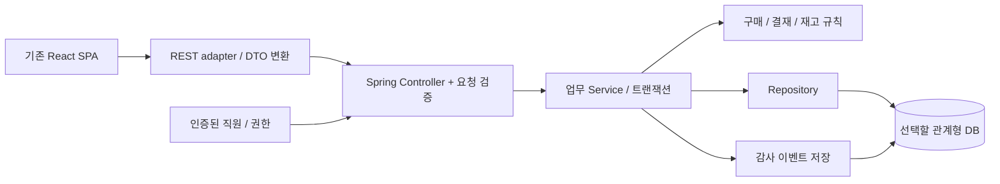

# 다음 GPT를 위한 백엔드 인수인계

기준일: 2026-09-29. 이 문서는 현재 결과와 다음 작업 제안을 구분한다. 아래 Spring 아키텍처와 API 예시는 **미구현 제안**이며 이미 만들어진 백엔드가 아니다.

## 1. 전달할 자료

다음 GPT에 프로젝트 ZIP 또는 소스를 첨부하고 이 문서를 먼저 읽도록 요청한다. 문서만 전달하면 소스 수준 검증은 불가능하므로, 구현 단계에서는 코드를 함께 제공한다.

- [프론트엔드 구조](FRONTEND-ARCHITECTURE.md)
- [현행 API 계약](API-CONTRACT.md)
- `src/domain/types.ts`, `src/api/client.ts`, `src/api/hooks.ts`
- `src/features/purchasing/config.ts`, `src/features/approval/config.ts`
- `src/api/store.ts`, `src/domain/effects.ts`
- `tests/domain.test.ts`, `tests/e2e/app.spec.ts`

## 2. 확정된 현재 상태

React/TypeScript/Vite ERP SPA다. 공통 화면 설정을 이용한 54개 경로, 36종 리소스, 전역 Assistant가 있다. 데이터는 메모리와 localStorage에 저장한다. `VITE_API_MODE=rest`로 선택 가능한 fetch 어댑터가 있지만 실제 Spring 서버와 연결한 결과는 없다.

사용자 이름 옆 선택은 결재 시연용 actor 변경이다. 로그인·비밀번호·세션·JWT 인증을 구현한 화면이 아니다. AI도 외부 모델 호출 없이 동작하는 Mock다.

디자인은 차콜 메뉴, 선명한 초록 강조, 보고서의 초록 농도 차이를 유지한다. 현 단계의 목적은 화면 재디자인보다 실제 데이터와 업무 규칙을 연결하는 것이다.

## 3. 첫 번째 구현 범위 제안

**로그인한 직원이 구매요청을 작성하고, 정해진 결재자가 승인한 뒤 발주와 입고로 연결되는 흐름**을 첫 단위로 삼는다. 매입·지급·회계, 생산·급여·AI는 후속 범위로 둔다.

Java/Spring Boot를 사용하는 방향은 정해져 있다. Java/Spring Boot 정확한 버전, DB 제품, 빌드 도구, 인증 방식, 배포 환경은 아직 결정하지 않았다. Redis, Kafka, Kubernetes, 마이크로서비스 도입도 결정 사항이 아니다. 먼저 단일 Spring 애플리케이션 안에서 업무별 패키지를 나누는 구조를 검토한다.



각 상자는 역할 구분이며 별도 서비스 배포를 뜻하지 않는다.

## 4. ERD에서 검토할 엔티티

아래는 설계 출발점이다. 구현된 테이블 목록이 아니며 PK, FK, 유니크 제약, nullable, 인덱스는 다음 설계에서 확정한다.

| 엔티티 후보 | 핵심 관계/설계 이유 |
| --- | --- |
| Employee, Department, Role | 이름 대신 직원 ID, 소속과 권한 식별 |
| Partner, Item, Warehouse | 거래처/품목/창고 기준정보 |
| PurchaseRequest, PurchaseRequestLine | 요청 헤더와 여러 품목행 분리 |
| ApprovalDocument, ApprovalStep | 요청과 결재 연결, 순서·결재자·결정 시각 저장 |
| ApprovalPolicy, ApprovalLineTemplate | 정책 변경과 진행 중 문서의 결재선 구분 |
| PurchaseOrder, PurchaseOrderLine | 승인된 요청에서 발주 생성, 원천 행 추적 |
| GoodsReceipt, GoodsReceiptLine | 발주 대비 입고 수량 추적, 부분입고 확장 |
| StockBalance, StockMovement | 현재 수량과 입출고 근거 이력 분리 |
| AuditEvent | 처리자, 동작, 대상, 변경 시각, 필요한 변경 내역 |

예를 들어 요청 1건에는 품목행 N개, 결재문서 1건에는 결재단계 N개가 연결된다. 요청과 결재의 1:1/1:N은 재상신을 같은 문서의 새 회차로 둘지 새 문서로 둘지 먼저 결정해야 한다. 현재 Mock는 반려/회수된 결재문서를 재사용하고 단계 상태를 초기화한다. 이 단순화를 운영 이력 모델로 그대로 복사하지 않는다.

서버 내부 PK와 화면 문서번호도 분리 여부를 결정한다. `RecordData.values` 전체를 무분별한 JSON 컬럼으로 옮기기보다 검색·검증·관계가 필요한 필드를 명시적으로 모델링한다.

## 5. 기존 화면과 서버를 연결하는 경계

| 현재 구현 | 연결 때 할 작업 |
| --- | --- |
| `actor`를 요청 본문에 보냄 | 서버에서 인증 정보로 행위자 확정. 클라이언트 actor를 신뢰하지 않음 |
| `RecordData` 공통 화면 모델 | 업무별 Request/Response DTO를 정의하고 adapter에서 매핑 |
| 이름 문자열로 품목·직원·거래처 참조 | 서버 ID 기반 참조 및 표시명 분리 |
| `save`가 생성/수정을 POST 하나로 처리 | POST/PATCH 또는 PUT 정책 확정 후 adapter 매핑 |
| 한글 액션명과 상태 문자열 | 서버 enum/명령 코드와 표시 라벨 분리 |
| `canEdit`/`validateRecord`를 store에서 import | 순수 화면 검증 분리, 서버가 권한·불변식 재검증 |
| 모든 업무 모드가 한 번에 REST로 전환됨 | 일부 기능만 연결할 단계라면 리소스별 adapter 선택 등을 명시적으로 설계 |
| `ListResult.all`과 최대 10만 건 조회 | 별도 summary/lookup/report API, 서버 집계·pagination |
| 오류가 `요청 실패 (status)`로 표시됨 | 표준 오류 body, 필드 오류, 401/403/409 처리 |
| 임의 actor 전환 Context | 실제 로그인 사용자 조회와 세션 만료 UI |
| 정적 PARTNERS/ITEMS/계정 선택지 | 실제 기준정보 API로 치환, 데모 fallback 노출 여부 결정 |
| 클라이언트 보고서 합산 | 서버 조회 권한과 집계 기준을 적용한 보고서 API |
| 브라우저 변경 이력 | 서버에서 신뢰 가능한 감사 이벤트 생성 |

즉 환경변수 변경만으로 운영 백엔드 연결이 완료되는 것은 아니다. 현재 adapter는 교체 지점이며 DTO·권한·집계 계약 변경에 맞춘 일부 화면 수정도 필요하다.

현재 HTTP 경로는 [API-CONTRACT.md](API-CONTRACT.md)를 따른다. 도메인별 URL로 새로 설계한다면 다음처럼 매핑할 수 있다. 아래 경로는 예시다.

| 현재 클라이언트 의미 | 향후 경로 예시 |
| --- | --- |
| purchase-requests 목록 | `GET /api/purchase-requests` |
| 구매요청 생성 | `POST /api/purchase-requests` |
| 작성중 요청 수정 | `PATCH /api/purchase-requests/{id}` |
| 결재 상신 | `POST /api/purchase-requests/{id}/submit` |
| 결재 승인 | `POST /api/approvals/{id}/approve` |
| 결재 반려 | `POST /api/approvals/{id}/reject` |
| 승인된 요청의 발주 생성 | `POST /api/purchase-requests/{id}/purchase-orders` |
| 현재 사용자 | `GET /api/me` |

목록 page는 현재 1부터 시작한다. 서버 pagination의 시작 번호가 다르면 변환한다. 금액은 서버 정밀도와 JSON 표현을 확정하고, 날짜는 업무일과 감사 timestamp를 구분한다. fetch는 `credentials: include`이므로 선택한 인증 방식에 맞춰 CORS·쿠키·CSRF 또는 토큰 전달 정책을 함께 맞춘다.

## 6. 반드시 서버에서 다룰 업무 규칙

- 일반 문서의 조회/수정/상신도 직원·역할·부서 권한으로 검증한다. Mock의 UI 버튼 조건이 권한 설계의 전부는 아니다.
- 결재자는 현재 순서에서만 처리한다. 승인과 반려가 동시에 들어오거나 동일 요청이 재전송되는 경우를 처리한다.
- 상신 시 결재자 목록과 정책 근거를 어떤 형태로 고정할지 정하고, 재상신과 대결/부재 처리는 범위를 명시한다.
- 최종 승인 시 결재단계·결재문서·구매요청·감사 이벤트의 변경이 함께 성공하거나 실패해야 한다.
- 승인된 요청에서 발주를 중복 생성하지 않도록 DB 제약과 요청 재시도 정책을 설계한다.
- 입고 확정과 재고 증가·수불 기록은 같은 업무 처리에 묶는다. 확정 취소와 부분입고는 지원 여부 및 규칙을 먼저 정한다.
- 금액은 서버에서 품목행으로 다시 계산한다. 클라이언트 금액·잔액·문서 상태를 그대로 저장하지 않는다.
- 충돌 제어는 `version` 기반 낙관적 잠금 등 선택 근거를 설명하고 DB 트랜잭션 테스트로 확인한다.

## 7. 첫 단계 완료 기준

1. DB 초기화/마이그레이션과 시연 계정·기준정보 준비 방법이 문서화된다.
2. 실제 로그인 사용자가 구매요청을 저장하면 새 브라우저에서도 같은 서버 문서를 조회할 수 있다.
3. 기안자 상신, 결재자 승인/반려, 반려 사유 표시와 재상신 규칙이 프론트까지 연결된다.
4. 권한 없는 직접 API 요청과 승인 전 발주 생성은 서버가 거부한다.
5. 중복 승인·동시 승인·중복 발주 생성에도 데이터가 일관되게 유지된다.
6. 입고 확정 후 재고와 수불이 한 번만 반영된다. 실패 시 일부 데이터만 남지 않는다.
7. API 명세, ERD, 상태 전이표, 서버 테스트 결과를 docs에 기록한다.

기존 Mock 테스트는 요구사항 예시로 재사용하되 결과를 그대로 서버 검증 실적으로 적지 않는다.

## 8. 다른 GPT에 복사할 메시지

```text
나는 Java/Spring Boot 백엔드 포트폴리오로 한국형 중견기업 ERP인 K-Flow ERP를 만들고 있다.
현재 React + TypeScript + Vite 프론트엔드와 브라우저 Mock를 완성해 두었다.
첨부한 프로젝트와 docs/FRONTEND-ARCHITECTURE.md, docs/API-CONTRACT.md,
docs/BACKEND-HANDOFF.md를 먼저 읽어줘.

현재 상태:
- 설정 기반 공통 UI를 이용한 54개 경로 화면, 36종 리소스가 있다.
- 구매요청 → 결재 → 발주 → 입고 → 매입 → 지급/전표의 Mock 흐름이 있다.
- ErpClient 인터페이스와 Mock/REST adapter가 있으나 실제 서버는 없다.
- localStorage 저장이며 이름 옆 사용자 변경은 데모 역할 전환이다.
- AI Assistant는 규칙 기반 Mock다.
- 메뉴는 차콜, 포인트와 보고서는 초록 계열 디자인을 유지한다.

다음 목표:
로그인/직원·부서·거래처·품목 기준정보를 바탕으로
구매요청 → 순차 결재 → 발주 → 입고 흐름부터 실제 백엔드로 연결하고 싶다.

먼저 아래를 코드에 근거해 설계해줘.
1. 현재 구현과 추가 구현을 구분한 요구사항 및 첫 구현 범위
2. ERD: 테이블 책임, PK/FK, 유니크 제약, 관계, 필요한 인덱스
3. 구매요청과 결재문서를 분리한 상태 전이표와 권한 규칙
4. Controller/Service/Repository 및 업무별 패키지 구조
5. 실제 DTO/API 명세와 기존 프론트 adapter의 매핑 방법
6. 트랜잭션 경계, 동시 승인 및 중복 발주 처리 방법
7. 단계별 구현 계획과 테스트·완료 기준

Java/Spring Boot 버전, DB, 인증 방식, 배포는 아직 확정하지 않았다.
현재 프로젝트를 확인하고 필요한 선택부터 설명해줘.
RecordData와 values를 그대로 단일 DB 테이블로 복사하지 말고 업무 관계를 설계해줘.
서버 권한 검증, 실제 AI, DB 동시성을 이미 구현한 것처럼 설명하지 말아줘.
학습과 면접 설명을 위해 각 설계의 이유와 대안도 이해하기 쉽게 알려줘.
소스 첨부가 없다면 구현을 추측하지 말고 필요한 파일을 알려줘.
```
