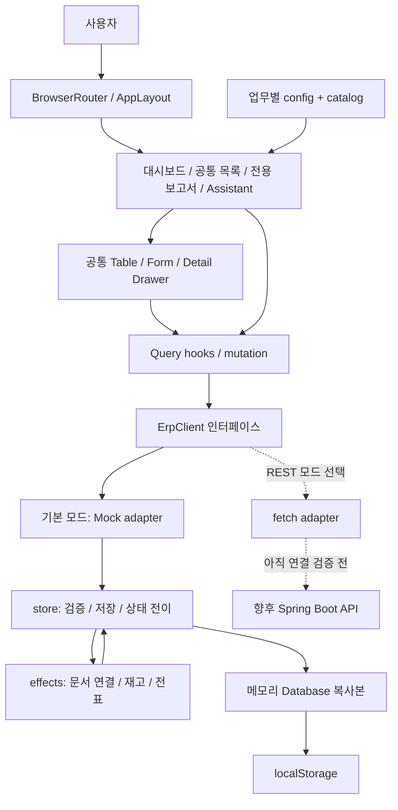
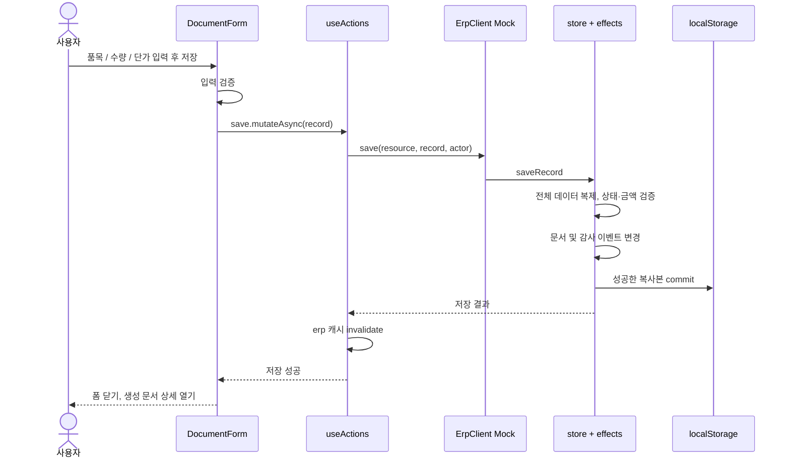

# K-Flow ERP 프론트엔드 구현과 아키텍처

작성 기준: 2026-09-29, 현재 프로젝트 소스. 이 문서는 **실제로 구현된 프론트엔드와 브라우저 Mock**를 설명한다. Spring Boot, 데이터베이스, 실제 로그인은 향후 구현 대상이다.

## 1. 프로젝트 목적과 현재 결과

한국 제조·유통 중견기업의 전자결재, 구매, 재고, 판매, 생산, 회계, 인사 업무를 하나의 화면 체계로 탐색하고 시연하는 ERP 프론트엔드다. Java/Spring Boot 백엔드를 연결하기 전에 화면에서 필요한 데이터, 문서 간 관계, 상태별 행동을 구체화했다.

현재 결과물은 React 기반 SPA이며, 54개 경로 화면과 전역 Assistant 패널, 36종의 리소스 설정을 제공한다. **54개의 독립 페이지를 각각 작성했다는 뜻은 아니다.** 동일한 자료를 결재대기/완료처럼 다른 조건으로 보여주는 화면도 있고, 공통 화면을 설정으로 재사용하는 구조다. 화면 수는 운영 수준 기능 완성도나 테스트 커버리지 비율을 의미하지 않는다.

| 영역 | 경로 화면 수 | 주요 내용 |
| --- | ---: | --- |
| 대시보드 | 1 | KPI, 매출·매입 시나리오, 결재 및 업무 이동 |
| 전자결재 | 7 | 내 결재함, 기안, 대기, 완료, 반려, 결재선, 정책 |
| 구매관리 | 6 | 구매요청, 발주, 입고, 매입, 채무, 지급 |
| 재고관리 | 7 | 재고, 품목, 창고, 수불, 이동, 조정, 부족재고 |
| 영업/판매 | 7 | 견적, 주문, 출고, 매출, 채권, 수금, 반품 |
| 생산관리 | 6 | BOM, 작업지시, 자재출고, 진행, 완제품 입고, 현황 |
| 회계관리 | 8 | 계정, 전표, 원장, 시산표, 손익, 재무상태, 기간, 역분개 |
| 인사관리 | 6 | 직원, 부서, 직급, 근태, 연차, 급여 |
| 보고서 | 5 | 경영, 구매, 매출, 재고, 생산 분석 |
| 감사로그 | 1 | 이벤트 조회와 원천문서 이동 |

목록·상세·생성/수정·상태 전이와 일부 업무 규칙을 Mock로 구현했다. 마스터 자료, 거래 문서, 조회 전용 자료는 제공하는 액션이 다르다.

## 2. 기술 구성과 사용 목적

버전은 `package.json`의 메이저 버전 기준이다. 정확한 설치 버전은 `package-lock.json`에 고정되어 있다.

| 기술 | 실제 사용 위치와 목적 |
| --- | --- |
| React 19 + TypeScript 5 | 컴포넌트 UI, 문서/화면 설정 타입, 상태별 렌더링 |
| Vite 7 | 개발 서버, HMR, 프로덕션 번들 생성 |
| Mantine 8 | Modal, Drawer, 입력, Select, Tabs, 알림 등 공통 인터랙션 |
| React Router 7 | 공통 레이아웃 안에서 업무 경로 이동, 문서 상세 URL |
| TanStack Query 5 | 비동기 읽기 캐시, 로딩/실패 상태, mutation 후 재조회 |
| Recharts 3 | 대시보드 및 보고서 차트 |
| Tabler Icons | 메뉴와 액션 아이콘 |
| 일반 CSS + Mantine theme | ERP 레이아웃, 브랜드 색, 반응형 스타일 |
| Vitest 3 | Mock의 상태 전이·금액·재고 등 업무 규칙 테스트 |
| Playwright | Chrome에서 메뉴·폼·결재·Assistant·모바일 시나리오 검증 |

현재 Redux/Zustand, Next.js, Axios, 실제 AI SDK는 사용하지 않는다. REST 어댑터는 브라우저 `fetch`를 사용한다. TypeScript 타입은 개발 시 계약이며 서버 응답에 대한 런타임 스키마 검증까지 제공하지 않는다.

## 3. 현재 실행 아키텍처



이 그림은 실행 흐름을 단순화한 것이다. 데이터 읽기·쓰기는 `ErpClient`로 모았지만, 완전한 계층 독립 구조는 아니다. `DocumentForm`은 `api/store.ts`의 `validateRecord`, `DocumentDetails`는 같은 파일의 `canEdit`을 직접 참조한다. `domain/effects.ts`도 catalog와 Mock Database 타입을 참조한다. 서버 연결 때 순수 UI 검증과 서버 업무 규칙을 분리할 개선 지점이다.

## 4. 코드 폴더와 책임

```text
src/
  main.tsx                       앱 진입, Provider, Router
  app/
    AppLayout.tsx                Sidebar/Header, 데모 사용자 Context, Assistant
    catalog.ts                   업무 모듈과 리소스 등록
    queryClient.ts               캐시 기본 정책
  pages/
    DashboardPage.tsx            대시보드
    DocumentListPage.tsx         URL 해석, 공통 목록, 전용 화면 분기
  components/
    DataTable.tsx                목록/정렬/pagination/loading/empty/error
    FilterBar.tsx                검색·상태·엔티티·기간 조건
    DocumentForm.tsx             설정 기반 입력, 품목행, 전표행, 금액 배분
    DocumentDetails.tsx          상세 조회, 상태 액션, 연결 문서 이동
    DetailDrawer.tsx             상세 패널 틀
    ApprovalTimeline.tsx         결재 순서 표시
    DocumentFlow.tsx             업무 문서 흐름 표시
    AmountAllocationTable.tsx    지급/수금 배분 입력
    StatusBadge.tsx              상태 텍스트와 색상
  features/
    */config.ts                  모듈 메뉴, 컬럼, 필드, 상태, 전이 정의
    reporting/                   대시보드 조회와 경영 분석
    accounting/                  전표 집계와 재무 보고서
    manufacturing/               생산 현황과 샘플 데이터
    assistant/                   Mock 질문 처리와 확인 카드
  api/
    client.ts                    ErpClient와 Mock/REST 구현
    hooks.ts                     useRecords/useRecord/useActions
    store.ts                     Mock 저장·검증·전이·감사 기록
    seed.ts                      초기 합성 데이터
  domain/
    types.ts                     RecordData/Resource/ListParams 등
    config.ts                    화면 설정 생성 helper
    effects.ts                   업무 액션의 연관 데이터 변경
    helpers.ts                   빈 문서·금액·표시 helper
    export.ts                    CSV 내보내기
  theme.ts / index.css           테마와 화면 스타일
```

`features`로 업무를 나누되 CRUD 성격이 비슷한 화면은 공유한다. 따라서 feature 폴더마다 독립된 서버, 데이터베이스, 완전한 도메인 서비스가 있는 구조는 아니다.

## 5. 설정으로 여러 화면을 구성하는 방법

`Resource`는 화면을 만드는 설명서다. 리소스 식별자, 문서번호 접두사, 컬럼, 입력 필드, 초기 상태, 허용 상태 전이, 읽기 전용 여부, 품목행 유무 등을 가진다. `Module`은 메뉴와 화면 경로를 정의한다.

예를 들어 `features/purchasing/config.ts`는 구매요청에 다음 내용을 설정한다.

```ts
// 실제 설정 중 일부
statuses: ["작성중", "승인대기", "승인완료", "발주완료"],
transitions: [
  transition("작성중", "승인대기", "결재 상신", "approvals"),
  transition("승인완료", "발주완료", "발주 생성", "purchase-orders"),
]
```

`DocumentListPage`는 `/purchasing/requests`를 읽고 catalog에서 설정을 찾는다. `ResourceList`가 설정을 `DataTable`, `DocumentForm`, `DocumentDetails`에 전달한다. 동일한 패턴으로 발주·판매주문 등을 표시한다.

재무제표와 경영 분석은 일반 문서 목록과 구조가 다르므로 `FinancialReport`, `ReportingPage`로 분기한다. 생산 현황은 공통 목록에 `ProductionOverview`를 추가한다.

이 방식은 필터나 오류 처리를 한 번 수정해 여러 업무에 반영할 수 있다. 대신 공통 폼과 상세 컴포넌트의 업무별 분기가 커질 수 있으므로, 백엔드 연결 이후 복잡해지는 기능은 전용 컴포넌트로 분리할 수 있다. 현재 구조를 마이크로프론트엔드나 엄격한 클린 아키텍처로 표현하지 않는다.

## 6. 상태 관리와 데이터 흐름

| 상태 종류 | 저장 위치 | 예 |
| --- | --- | --- |
| 화면 내부 상태 | React useState | 입력 중인 폼, 검색 조건, Modal, 반려 사유 |
| URL 상태 | Router + search params | 현재 업무, `?doc=PR-2026-0001`, `?new=1` |
| 앱 공통 상태 | SessionContext | 데모 actor, Assistant 열기 |
| 원격 데이터 형태의 상태 | TanStack Query | 목록, 상세, 대시보드, 회계 조회 |
| Mock 영속 데이터 | 메모리 + localStorage | 문서, 재고, 결재 이력, 감사 이벤트 |

목록 필터 전체가 URL에 저장되는 것은 아니다. 상세 문서는 `?doc=`로 다시 열 수 있지만 필터는 컴포넌트 state다. actor와 Assistant 대화는 서버 세션이나 영속 대화 저장소가 아니다.

목록 query key는 `['erp', resource, params]`, 상세는 `['erp', resource, 'detail', id]`다. 기본 `staleTime`은 15초, 읽기 재시도는 1회이며 창 포커스 시 재조회는 꺼져 있다. 저장/전이/결재 성공 후 `['erp']` 전체를 invalidate하여 연관 목록·상세·KPI를 다시 읽는다. 성공 전에 화면 값을 미리 확정하는 낙관적 업데이트는 사용하지 않는다.

전체 invalidate는 데모에서 연결된 문서를 빠뜨리지 않는 장점이 있으나 리소스가 커지면 불필요한 재조회가 발생한다. 백엔드 연결 후 관련 query만 갱신하도록 세분화할 수 있다.

## 7. 구매요청 저장과 결재 시퀀스



후속 과정은 구매요청 상세의 **결재 상신 → 현재 결재자 승인 → 최종 승인 → 발주 생성**이다. PR 상태와 결재문서 상태는 별도다. PR의 `승인대기`와 결재문서의 `상신/결재중`을 같은 enum 하나로 합치지 않는다.

결재문서에는 기안자, 단계별 결재자와 상태가 들어간다. 현재 순서의 결재자만 승인/반려하며 반려 사유가 필요하다. 회수 및 재상신 흐름도 있다. Mock의 활성 정책·금액 기준 선택은 새 결재문서 생성 시 적용되고 단계 목록이 문서에 복사된다. 운영용 정책 버전 관리나 재상신 시 정책 재평가 규칙까지 완성한 것은 아니다.

발주 확정 이후 입고, 매입, 채무, 지급, 전표를 연결하는 시연 흐름도 구현했다. 각 액션은 관련 문서 링크와 이력을 남긴다. 부분입고 상태는 있지만 실제 수량 분할과 여러 차수 입고를 모두 다루는 운영 모델은 아니다. 현재 후속 문서 생성은 같은 대상 리소스의 링크가 있으면 추가 생성을 제한한다.

## 8. Mock가 수행하는 역할과 한계

기본 데이터는 `seed.ts`와 일부 feature Mock 파일에서 만든다. 읽기/쓰기에 180ms 비동기 지연을 주어 loading과 실패 상태를 확인할 수 있다. `sessionStorage['kflow-network-error']='1'`은 개발·테스트용 통신 실패 스위치다.

저장 키는 `localStorage['k-flow-erp-v1']`이다. 새로고침 후 문서가 남는 이유는 서버 DB가 아니라 이 저장소다. 다른 브라우저나 사용자의 데이터와 동기화되지 않는다.

쓰기 작업은 `structuredClone(database())`로 복사본을 만든 뒤 검증과 연관 변경을 수행한다. 성공한 경우에만 commit하므로 중간 검증 실패가 원 데이터에 일부만 반영되는 일을 줄인다. 이것은 **단일 브라우저의 시뮬레이션**이며 DB 트랜잭션, 여러 탭의 동시 수정, 분산 잠금, 서버 멱등성을 보장하지 않는다.

Mock에서 검증하는 예는 지급 배분 합계/잔액, 전표 차대변, 마감 기간, 부족재고, 상태 전이 등이다. 실제 접근 제어는 전면 구현되어 있지 않다. 예를 들어 일반 문서 수정 여부는 주로 작성중 상태를 확인하고 부서·역할별 권한을 모두 검증하지 않는다. 브라우저 규칙은 서버 보안 경계가 될 수 없다.

## 9. 화면 데이터 모델

`RecordData`는 다양한 화면을 빠르게 시연하기 위한 공통 모델이다.

| 필드 | 의미 |
| --- | --- |
| id/title/status/date | 문서 식별·표시·상태·업무일자 |
| owner/partner/department | 담당자·거래처·부서의 데모 표시 문자열 |
| amount/dueDate | 원 단위 금액, 기한 |
| values | 리소스별 추가 필드, 문자열 또는 숫자 |
| lines | 품목·수량·단가 |
| journal | 계정·차변·대변 |
| approvals | 결재자·역할·단계 상태 |
| links | 관련 리소스와 문서 ID |
| history | 처리자·시각·행동 |

이 모델을 그대로 하나의 DB 테이블로 옮기는 것은 권하지 않는다. 서버에서는 구매요청/품목행/결재문서/결재단계/거래처 등을 분리하고 실제 식별자와 관계를 정의해야 한다. 화면 모델과 서버 DTO 사이의 변환은 adapter에서 맡을 수 있다.

데모 금액은 KRW 안전 정수다. 서버의 소수 단가·세금·반올림·통화 정책은 별도로 정해야 한다. `values.allocations`의 JSON 문자열도 서버에서는 타입이 있는 배분 항목 DTO로 바꿀 대상이다.

## 10. 보고서, 디자인, Assistant

보고서는 문서를 거래처/창고/생산라인으로 묶어 프론트에서 집계한다. 회계 보고서는 전기된 전표를 읽어 차변과 대변을 합산한다. 일부 조회는 `size: 100000`을 사용하므로 대용량 운영 방식으로 그대로 유지할 수 없다. 목록의 `all`은 owner/participant 범위는 적용하지만 일반 검색·기간·상태 필터를 모두 적용한 결과가 아니다. KPI의 기준과 목록의 필터 기준을 구분해야 한다.

대시보드 월별 매출·매입 추이는 `monthlyTrend`의 고정 시나리오다. 실제 DB 월별 실적 조회를 구현했다고 표현하지 않는다.

현재 디자인은 차콜 사이드바 `#24282b`, 초록 포인트 `#008000`, 밝은 본문 `#f5f5f8`이다. 보고서 항목은 초록색의 진하기로 구분하며 차트와 순위 영역에서 같은 항목에 같은 색을 쓴다. 이름 기반 색 매핑이므로 서버 전환 시 안정적인 엔티티 ID 기반 매핑을 고려할 수 있다. 색상 외에도 항목명과 순위를 표시한다. 데스크톱 업무 밀도와 모바일 메뉴/표 표시를 함께 고려했다.

Assistant는 정규식과 예시 질문에 따른 **규칙 기반 Mock**다. 5종 예시 질문, 근거 문서 링크, 구매요청 초안 확인/취소/생성 UI를 제공한다. 생성 확인 후에만 `api.save`를 호출한다. 실제 LLM 추론, RAG, SSE, 외부 모델 연결은 없다. REST 모드로 바꾸어도 `mockReply`가 자동으로 실제 AI가 되지 않는다.

## 11. 검증과 근거

기존 검증 기록은 [VALIDATION.md](VALIDATION.md), 테스트 코드는 `tests/domain.test.ts`, `tests/e2e/app.spec.ts`다. 초기 기능 검증에서 업무 테스트 10개와 브라우저 시나리오 8개가 통과했다. 이후 테마 수정 때 일부 브라우저 테스트를 재실행했고, 최신 초록 보고서 수정은 빌드와 보고서 화면 확인을 수행했다. **이번 문서 작성만을 위해 전체 테스트를 다시 실행한 것은 아니다.**

업무 테스트는 Mock 함수의 통합 동작을 확인하며 Spring 서버의 통합 테스트가 아니다. 브라우저 시나리오 통과도 성능·보안·접근성 전체 검증을 뜻하지 않는다. 관련 캡처는 [대시보드](screenshots/dashboard.png), [구매 상세](screenshots/purchase-detail.png), [결재](screenshots/approval.png), [보고서](screenshots/reporting.png), [모바일](screenshots/mobile.png)에서 확인한다.

## 12. 참고 자료와 다음 문서

기존 ERP 저장소의 UX와 구조를 분석하고 구현 코드를 새로 작성한 프로젝트다. 참고 커밋과 분석 대상은 [REFERENCE-ANALYSIS.md](REFERENCE-ANALYSIS.md), 라이선스 고지는 [REFERENCE-LICENSE.txt](REFERENCE-LICENSE.txt)에 있다. 참고 저장소의 기능 설명을 현재 구현의 기능으로 혼동하지 않는다.

다음 단계는 [BACKEND-HANDOFF.md](BACKEND-HANDOFF.md), 포트폴리오 설명문은 [PORTFOLIO-NOTES.md](PORTFOLIO-NOTES.md), 현행 HTTP 어댑터 계약은 [API-CONTRACT.md](API-CONTRACT.md)를 참고한다.
