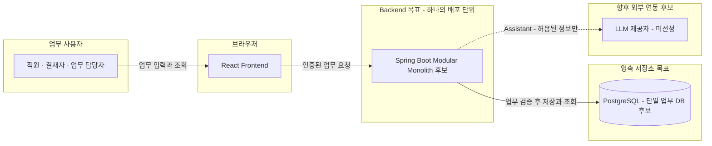
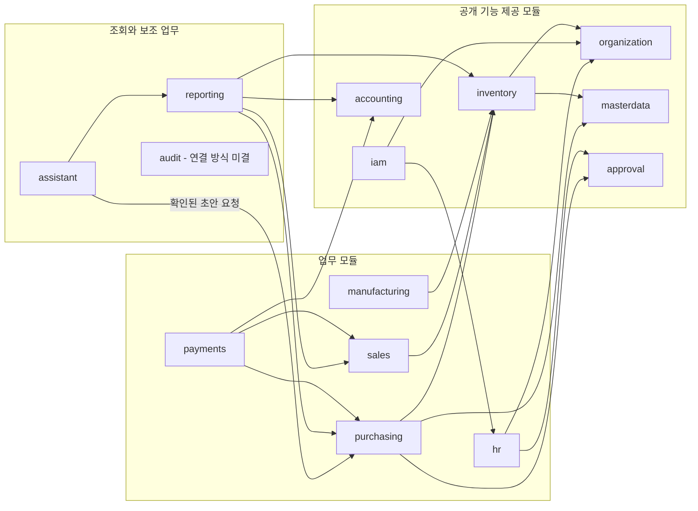

# K-Flow ERP Architecture Overview v0.1

- 작성일: 2026-10-01
- 상태: **Architecture v0.1 — 데이터 소유권·조건부 Accounting 의존·Cross-module Orchestration 원칙 반영**
- 반영일: 2026-10-01. 이번 세 항목 외 기존 추천 구조와 후속 질문은 유지한다.
- 입력: [REQUIREMENTS v0.2](../../REQUIREMENTS-v0.2.md), 사용자가 명시 채택한 DR-01/02/03/22 및 이번 Architecture v0.1의 세 항목
- 현재 구현: React Frontend 및 브라우저 Mock. 아래 Spring Boot·PostgreSQL 구조는 목표 구조이며 구현 완료를 뜻하지 않는다.
- 이번 범위: 시스템 Context, 모듈 책임·의존 방향·경계, 배포/저장소 구조의 후보와 판단 근거.
- 범위 밖: ERD, 테이블/컬럼/Entity, REST 또는 내부 Port의 구체적인 계약·시그니처, Repository/Service/Controller, Migration, Spring Boot 코드, Frontend 수정.

## 1. 확정과 초안을 읽는 기준

| 표기 | 의미 | 이 문서에서의 대상 |
| --- | --- | --- |
| ADOPTED / 확정 입력 | 사용자가 명시 채택한 업무 원칙. 재질문하지 않음 | DR-01/02/03/22 및 기존 목표 불변조건, AQ-01 소유권, 조건부 Accounting 의존, 업무 시작 모듈의 Orchestration 원칙 |
| 목표 구성요소 | 사용자가 Architecture에 포함하도록 정한 대상. 구현/제품 버전까지 확정한 것이 아님 | React Frontend, Spring Boot Backend, PostgreSQL |
| DRAFT / 추천 구조 | 이번 문서에서 제안하는 Architecture 기준. ADOPTED로 자동 승격하지 않음 | Modular Monolith, 단일 DB, 채택 범위 밖의 의존 후보 및 경계 구현 방식 |
| OPEN / 후속 결정 | 도메인 업무·실패 시나리오를 정한 뒤 확정할 내용 | 구체적 트랜잭션 범위·감사 실패·Snapshot 필드·Data Scope·조회 일관성 등 |

**확정 입력:** K-100은 자체 생산 완제품, PCB Type-A/알루미늄 하우징은 구매 원재료·부품, S-200/M-50은 재판매 상품, MacBook은 내부 사용 품목이다. v1에서 역할에 맞는 업무만 허용하되 혼합 조달의 미래 확장을 막는 모델을 미리 고정하지 않는다. MacBook의 비용/고정자산 처리는 Accounting 단계의 별도 결정이다.

단일 법인에 복수 사업장·창고를 두며 사업장/창고/부서를 구분한다. 다법인은 v1 제외이며 사업장 간 이동은 법인 간 매출·매입이 아니다. 기준정보는 Stable ID와 최소 Snapshot 원칙을 따른다. Employee/User, Position/Role, 시스템 권한/실제 결재자를 구분하고 Backend가 인증·권한·대상 데이터를 검증한다. SELF/DEPARTMENT/SITE/ALL은 기반 후보이지 전 모듈 공통 권한표의 확정값이 아니다.

문서 초안은 재고·채무의 실제 확정과 다르며, 어떤 확정의 **필수** 결과 중 일부만 성공으로 남기지 않는 COM-13 목표를 유지한다. 다만 입고 확정에 회계까지 반드시 포함되는지(DR-13), 필수 감사의 범위와 실패 처리(DR-25)는 아직 미결이다.

## 2. 전체 시스템 Context

한결 인더스트리의 직원은 브라우저에서 업무 문서를 작성·조회하고 권한에 따라 결재·확정을 수행한다. Frontend는 표시와 입력을 담당하고, 목표 Backend는 업무 검증·권한 강제·영속 결과의 소유자가 된다. PostgreSQL은 이 Backend가 사용하는 단일 업무 저장소 후보다.

### 2.1 현재와 목표의 구분

| 구성 | 현재 확인한 상태 | 목표 책임 |
| --- | --- | --- |
| Frontend | React/TypeScript/Vite, Mantine, TanStack Query. 구매 폼 등 Mock 시연 가능 | 기존 UI를 유지하며 업무 입력·조회·오류/처리 상태 표시. 버튼 숨김은 보조 UX |
| Frontend 데이터 연결 | `src/api/client.ts`가 기본적으로 브라우저 Mock 사용. REST 전환 어댑터도 존재 | 향후 확정된 Backend 계약에 연결. 기존 공통 리소스 어댑터를 최종 API로 확정하지 않음 |
| Backend | K-Flow Spring Boot 구현은 아직 없음 | 인증 신원·문서 상태·불변조건·권한/범위 검증, 모듈 간 업무 처리 |
| Database | Mock은 localStorage에 저장 | PostgreSQL 영속 저장, 필요한 업무 단위의 일관된 반영 |
| 외부 은행·증빙 | 구매 지급은 외부 완료 내역 기록. 실제 송금/전자세금계산서 발급 없음 | 현재 확정한 범위를 유지. 별도 외부 연동은 해당 업무 결정 후 검토 |
| AI | 키워드 기반 Mock 패널 | 향후 권한 있는 조회·사용자 확인 후 초안 생성. 모델/제공자/연동 방식은 미정 |

현재 브라우저가 전달하는 담당자 이름을 Backend 인증 신원으로 신뢰하지 않는다. 기존 Mock 저장소를 서버로 그대로 옮기거나 공통 `RecordData`를 모든 Backend 도메인의 모델로 복제하지 않는다.

### 2.2 Mermaid — 목표 배포/접근 Context

아래는 **목표 후보** 구조다. 실선은 목표 내부 접근, 점선은 향후 검토하는 외부 AI 연동이다. 인증이나 Published Port는 별도 네트워크 서비스로 배포한다는 뜻이 아니다. 은행은 현재 시스템에서 실행하는 연결이 없어 통신 화살표를 그리지 않았다.

Frontend에서 DB 또는 외부 모델로 직접 업무 쓰기를 수행하는 경로는 두지 않는 안이다. AI 제공자가 추가되더라도 업무 성공 여부는 Backend의 기존 규칙으로 판단한다.

## 3. 왜 Modular Monolith와 단일 DB를 추천하는가

### 3.1 선택 후보 비교 — DRAFT

| 후보 | 얻는 것 | 부담/포기하는 것 | 현재 판단 |
| --- | --- | --- | --- |
| 경계 없는 단일 애플리케이션 | 초기 연결 작업이 적음 | 다른 업무 데이터에 직접 접근하기 쉬워 변경 영향·정합성 책임을 설명하기 어려움 | 비추천 |
| Modular Monolith + 단일 PostgreSQL | 업무 책임을 나누면서 한 업무의 여러 변경을 로컬 트랜잭션으로 묶을 수 있음. 단일 실행·배포 경로 | 모듈별 독립 배포/자원 격리 불가. 경계를 자동 검사하지 않으면 쉽게 무너짐 | 초기 추천 |
| Microservices + 분리 저장소 | 독립 배포·확장·장애 격리 여지 | 원격 실패·부분 성공·메시지 전달·중복 처리·분산 운영까지 처음부터 다뤄야 함 | 초기 선택에서 제외하는 안 |

선택 이유는 ERP 업무와 현재 개발 범위다. 입고·재고 또는 지급·배분 등은 일관된 결과를 보여야 하고, 아직 도메인 경계가 구체화되는 단계다. 처음부터 분산 환경을 운영해야 한다는 요구나 모듈별 부하 측정 근거가 없다. 직원 200~500명이라는 가정만으로 처리량이나 성능을 보장하지 않는다.

### 3.2 단일 DB의 의미와 한계

하나의 Spring Boot 배포 단위와 하나의 PostgreSQL 업무 DB를 초기안으로 추천한다. 이는 모듈별 데이터 소유권까지 없앤다는 뜻이 아니다. 각 모듈은 자기 데이터 변경을 책임지고 다른 모듈은 공개 Port를 통해 요청한다.

단일 DB는 로컬 트랜잭션·일관된 백업/복구·대사 출발점을 단순하게 한다. 반면 DB 장애·자원 경합의 영향 범위가 공유되며 모듈별 독립 마이그레이션도 제한된다. 스키마 분리, DB 권한 계정 분리, 테이블 간 제약, 연결 풀 및 배포 환경은 후속 결정이며 이번 문서에 테이블을 만들지 않는다.

Microservices로 분리하면 Port 호출을 네트워크로 바꾸는 것 외에도 데이터 소유권, 로컬 원자성 대체, 재처리, 관측·배포 정책을 다시 설계해야 한다. 추후 분리가 공짜이거나 반드시 필요하다고 주장하지 않는다.

## 4. Backend Module과 데이터 소유권 — AQ-01 ADOPTED

아래 14개 모듈의 **데이터 소유권과 책임은 Architecture v0.1의 채택 기준**이다. 14개 서버나 14개 DB를 뜻하지 않는다. AQ-01은 이번 결정으로 정리하며, 기준정보라는 이유만으로 모든 정보를 `masterdata`에 모으지 않는다. 소유권 확정은 개별 업무의 계산·상태 전이·회계 인식 정책까지 확정했다는 뜻이 아니다.

| Module | 채택한 책임과 소유 대상 | 책임 밖 / 다른 모듈과의 경계 |
| --- | --- | --- |
| organization | Company, Site, Department, Position 및 조직 기준 정의 | 직원 개인의 인사 이력은 hr, 로그인/Role은 iam, 실물 창고 운영은 inventory |
| iam | User, Role, 인증 및 시스템 접근 권한 | Employee 인사 원본·직급 정책·문서별 실제 결재 순서는 소유하지 않음 |
| masterdata | Item, Partner, Unit 등 거래 공통 기준정보 | Account는 accounting, Employee는 hr, BOM은 manufacturing. 모든 기준정보의 만능 저장소로 만들지 않음 |
| approval | Approval Policy, Approval Step, 결재 이력 및 적용된 결재 근거 | PR/연차/지출의 업무 불변조건이나 실제 입고·지급을 직접 실행하지 않음 |
| purchasing | Purchase Request, Purchase Order, Goods Receipt, Vendor Bill, AP Subledger | 실물 재고장은 inventory, 지급 거래는 payments, GL은 accounting |
| inventory | Warehouse, Stock Ledger, Current Stock / Inventory Balance 및 재고 업무 검증 | PO·매입 증빙·생산지시의 상태를 직접 변경하지 않음. 평가·품질·LOT 지원 범위는 기존 DR 후속 |
| accounting | Account, Fiscal Period, Journal Entry, Journal Line, General Ledger 및 회계 검증 | 다른 업무 원천 문서를 대신 수정하지 않음. AP/AR 보조부는 purchasing/sales가 소유하며 중복 소유하지 않음 |
| payments | Payment / Receipt, Allocation — 지급·수금 기록과 배분 근거 | AP/AR 원금·잔액을 직접 갱신하지 않고 소유 모듈에 적용 요청. 은행 송금 실행은 현재 구매 범위 아님 |
| sales | Sales Order, Delivery, Invoice, Return, AR Subledger | 실물 수불·수금 기록·GL의 내부 데이터 변경은 해당 소유 모듈 책임 |
| manufacturing | BOM, Work Order, Production Result / WIP 관련 업무 근거 | 재고장과 GL을 직접 작성하지 않음. 부분실적·원가 배부 범위 DR-18/19 후속 |
| hr | Employee, Attendance, Leave, Payroll 관련 인사 원본 | 조직/직급 기준 정의는 organization, 로그인 계정·Role은 iam. 연차/급여 계산 범위 DR-24 후속 |
| reporting | 원천 데이터를 소유하지 않고 공개 조회를 조합하여 보고서·대사·근거 탐색 제공 | 거래 확정·잔액 정정·회계 분류 원본을 소유하지 않음. 통계값으로 원장을 덮어쓰지 않음 |
| audit | 감사 기록과 권한 있는 조회 | 거래의 실제 성공/실패를 임의로 결정하지 않음. 필수 저장 방식·실패 정책 DR-25 미결 |
| assistant | 권한 있는 조회 및 초안 생성 조정 | 독립 승인권·재고/GL 쓰기·범위 우회 없음. 기존 업무 모듈의 검증을 거침 |

### 4.1 특히 구별할 소유권

- **Employee와 User:** hr의 직원 기본정보가 Phase 1 계정 연계에 필요할 수 있다. 이를 Phase 9 급여 구현까지 미루거나 Employee를 User 내부에 중복 생성하지 않는다. 실제 구현 순서는 후속 계획에서 정한다.
- **사업장과 창고:** organization은 장소로서의 사업장, inventory는 실물 재고를 두는 창고를 맡는다. 창고는 사업장을 Stable ID로 식별한다. 부서가 특정 창고와 같다는 전제를 두지 않는다.
- **입고 문서와 수불:** purchasing이 PO 이행·입고 근거를 판단하고 inventory에 실물 수량 반영을 요청한다. 입고 문서 생성만으로 수불을 만들지 않는 기존 목표를 유지한다.
- **AP/AR와 지급/수금:** purchasing/sales가 원금·적용 정산에 따른 미결 잔액의 권위 있는 원본을 맡고 payments가 실제 지급/수금 기록 및 배분 근거를 맡는다. payments 내부의 별도 잔액을 또 하나의 정답으로 두지 않는다. 동일 배분이 두 번 적용되지 않는 검증은 관련 소유 모듈을 통해 수행한다.
- **회계:** GL은 accounting, AP Subledger는 purchasing, AR Subledger는 sales가 소유한다. Reporting/Reconciliation에서 GL과 각 Subledger를 비교한다. 계정과목을 masterdata와 accounting 양쪽에서 독립 관리하지 않는다. 어떤 사건에 어떤 전기를 요청할지는 DR-12/13/14/19의 후속 결정이다.

AP/AR을 accounting에 집중시키는 대안은 검토 후보였으나 v0.1에서는 채택하지 않는다. 사용자 결정에 따라 AP는 purchasing, AR은 sales, Allocation은 payments가 소유한다. 원천 거래와 보조부의 정합성 책임이 명확해지는 대신 payments가 두 보조부의 공개 기능에 의존한다는 비용이 있다.

## 5. Module Boundary와 Published Port 원칙

### 5.1 모듈 경계 기준 — 채택 원칙과 구현 후보

1. 다른 모듈의 **Repository 직접 접근·수정을 금지한다**. 같은 DB라도 다른 모듈의 테이블에 직접 쓰거나, 내부 테이블을 임의 조회해 규칙을 우회하지 않는다.
2. 다른 모듈의 **Entity 직접 참조·변경을 금지한다**. Entity 전달, 모듈을 가로지르는 객체 연관 탐색, 내부 저장 모델을 그대로 반환하는 것을 공개 계약으로 삼지 않는다.
3. 협력은 소유 모듈의 **Published Port**를 통한다. 여기서 Port는 같은 프로세스 안에서 사용할 공개 업무/조회 경계이며 REST endpoint가 아니다. 이번 문서에서는 함수명·입출력 필드·URL을 설계하지 않는다.
4. 모듈 간 참조는 Stable ID와 해당 업무에 필요한 최소 값/읽기 결과로 전달한다. 공개 반환값에 내부 Entity가 숨어 들어가 경계가 무너지지 않게 한다.
5. 업무의 최종 검증과 저장은 데이터를 소유한 모듈이 책임진다. 호출자가 잔량을 미리 조회했다는 사실만으로 저장 시점의 유효성을 보장하지 않는다.
6. 모듈 간 순환 의존을 피한다. 반대 방향의 처리 필요가 생겼다고 양쪽 내부 서비스를 서로 호출하지 않고 처리 흐름의 조정 위치를 검토한다.

명시적으로 공개한 조회 모델이 필요해지는 경우에도 다른 모듈의 내부 테이블을 자유롭게 조회할 권한으로 확대하지 않는다. 교차 조회 예외는 AQ-06의 별도 검토 사항이다.

### 5.2 모듈 내부 구조 후보

각 모듈은 외부에 제공하는 공개 계약, 업무 진행을 조정하는 부분, 내부 업무 규칙, 저장/외부 연동 부분을 구별하는 안이다. 정확한 패키지 이름, Gradle/Maven 다중 모듈 여부, 인터페이스 개수와 클래스 계층은 이번에 고정하지 않는다. 모든 CRUD에 같은 추상 계층을 기계적으로 추가할 필요도 없다.

ArchUnit 또는 Spring Modulith 등으로 공개 경계·내부 의존·순환 의존을 검사하는 방법은 후속 후보다. 기술 채택이나 검사 통과를 주장하지 않는다. 특히 Java import 검사만으로 SQL을 통한 타 모듈 테이블 접근까지 모두 검출할 수 있다고 가정하지 않는다.

### 5.3 확정과 후속 결정의 연결

| 주제 | 확정 입력 | 이번 Architecture 기준 | 후속 결정 |
| --- | --- | --- | --- |
| 모듈 간 데이터 참조 | DR-03 Stable ID·최소 Snapshot | 다른 Entity/Repository 직접 참조 없이 공개 Port 사용 | 실제 Port 계약·Snapshot 필드·버전/변경 호환 |
| 권한 | DR-22 Backend 인증·권한·대상 검증 | 공통 진입부와 업무 소유자의 검증 역할 구분 | 인증 방식·Role 조합·모듈별 Scope·민감 필드 |
| 트랜잭션/조정 | COM-13 및 업무 시작 모듈의 Application Service가 조정한다는 기본 원칙 | 각 소유 모듈의 Published Port를 통해 업무 진행; 관련 로컬 쓰기를 한 업무 단위로 묶는 것은 추천안 | 실제 Transaction Boundary·격리수준·Lock·Idempotency·Retry 및 예외 흐름 |
| 감사 | AUD-01 추적 가능성 목표 | 중요 업무 기록과 선택적 관측/알림을 구분 | DR-25: 필수 감사 실패 시 성공 여부·저장 방식 |
| Reporting | RPT-01/02의 근거·권한·집계 일관성 | Reporting이 업무 모듈의 공개 조회를 소비 | 조회 스냅샷·집계/과거 기준일·대량 조회 전략 |

## 6. 예상 Module Dependency — DRAFT

화살표와 아래 표는 **호출/코드 의존 방향**이다. 업무 문서의 시간 순서와 같지 않으며 모든 후보 호출을 당장 구현한다는 뜻도 아니다. 직접 의존은 제공자 모듈의 공개 Port로 제한한다.

| 호출하는 모듈 | 예상 의존 대상 | 목적/경계 |
| --- | --- | --- |
| organization | 없음(업무 모듈 기준) | 조직·사업장·직급 기준의 소유 |
| masterdata | 없음(업무 모듈 기준) | 거래 공통 기준정보의 소유 |
| accounting | 없음이 초기안 | 전달된 유효 업무 근거를 전기·검증; 원천 업무 내부로 역조회하지 않는 방향. 추가 공개 참조 필요는 해당 Use Case 상세설계에서 검토; AQ-01 소유권을 재정의하지 않음 |
| inventory | masterdata, organization | 품목·단위와 사업장 확인. accounting 연결 주체는 DR-13/AQ-03 후속 |
| approval | 업무 모듈 직접 의존 없음이 초기안 | 신뢰 가능한 제출 근거로 정책/Step 판단. 인사·조직 조회 조정은 아래 6.1 참조 |
| hr | organization, approval; accounting은 급여 연동 후속 | 직원과 조직 연결, 휴가 결재. payroll 범위 확정과 별개로 직원 기본정보 제공 |
| iam | hr, organization의 제한된 공개 조회 | 계정과 직원의 연결·신원/소속 판단. 급여·근태 상세를 가져오지 않음 |
| purchasing | masterdata, approval, inventory; accounting은 조건부 | PR 승인 근거, 실물 입고, 매입·AP. 회계 호출 사건·시점은 DR-12 / DR-13 이후 상세화 |
| sales | masterdata, inventory; accounting은 조건부 | 주문·출고·AR. 매출·COGS 관련 회계 호출 사건·시점은 DR-14 이후 상세화 |
| manufacturing | masterdata, inventory; accounting은 조건부 | BOM 품목, 투입/산출 수불. 제조원가·WIP 관련 회계 호출 사건·시점은 DR-19 이후 상세화 |
| payments | purchasing, sales, accounting | 채무/채권 배분 적용과 지급/수금 회계 연계 |
| reporting | 필요한 업무 모듈의 공개 조회 | organization/masterdata/hr/purchasing/inventory/accounting/payments/sales/manufacturing 등에서 권한 있는 근거만 조합 |
| audit | 방식 미정 | 공개 기록 요청을 받는 방향 또는 공개 사건 소비 방향을 DR-25/AQ-05에서 결정. 임의 내부 재조회는 허용하지 않는 안 |
| assistant | reporting 및 초안 생성 대상 모듈의 제한된 공개 기능 | 읽기와 명시 확인한 초안 생성. 승인·입고확정·지급·전기 권한으로 확대하지 않음 |

**Accounting 의존의 의미 — 채택 기준:** `purchasing → accounting`, `sales → accounting`, `manufacturing → accounting`은 가능한 Architecture 의존 방향이다. **회계 모듈에 의존할 수 있음**과 **특정 Business Event에서 반드시 전기함**을 구분한다. 구매/입고는 DR-12 / DR-13, 판매/COGS는 DR-14, 제조원가/WIP는 DR-19를 결정한 뒤 실제 호출 사건과 시점을 상세화한다. 이 표만으로 입고·출고·생산완료 시 자동 전기나 동일 트랜잭션 포함을 확정하지 않는다.

### 6.1 IAM/HR/Approval의 순환 의존을 피하는 방법

모든 업무 모듈이 IAM을 직접 호출하도록 만들면 `iam → hr → iam` 같은 순환이 생길 수 있다. 초기안에서는 요청 진입의 조정 부분이 IAM으로 신원을 확인하고, 업무에 필요한 신뢰 가능한 권한/소속 근거를 전달한다. 각 업무는 그 근거와 자기 문서 상태·대상에 대해 검증한다. 이 조정 부분은 또 하나의 업무 모듈이나 배포 서비스가 아니며, 업무 규칙을 한곳으로 몰아넣는 만능 서비스로 만들지 않는다.

Approval도 HR 내부를 직접 탐색하면서 HR이 다시 Approval을 호출하는 구조를 피한다. 서버의 해당 업무 처리 흐름에서 공개 조회로 인사·조직 근거를 모아 승인 정책에 제공하고 Approval이 Policy/Step을 결정하는 안이다. 브라우저가 보낸 결재자 목록·부서·금액을 검증 없이 신뢰한다는 뜻이 아니다. 담당자 해석·정책 버전·결재 후속 실행의 구체적 연결 방식은 7.3절의 기본 조정 원칙 아래 AQ-02/04와 DR-17에서 상세화한다.

승인 완료 후 purchasing/hr 등이 후속 실행을 요청받거나 승인 근거를 확인하는 방향을 유지한다. Approval이 구매 Repository나 휴가 Entity를 직접 갱신하지 않는다. 자동 후속 실행과 이벤트/재시도 방식은 이번에 정하지 않는다.

### 6.2 Mermaid — 주요 논리 모듈 의존 후보

아래는 **대표 경로만** 그린 논리 모듈도다. 모든 노드는 앞 Context의 Spring Boot 한 프로세스 안에 있다. 실선은 대표 공개 호출 후보이며 생략한 의존은 위 표를 따른다. audit의 선은 기록 요청/이벤트 방식이 미결이므로 생략했다. 선이 없다고 감사 대상에서 제외한 것은 아니다.

## 7. Cross-module 호출과 Transaction

### 7.1 후보와 추천

| 방식 | 적합한 상황 | 위험/Trade-off | 이번 판단 |
| --- | --- | --- | --- |
| 같은 프로세스의 동기 Published Port + 공통 업무 트랜잭션 | 같은 확정의 필수 결과가 함께 성공해야 하는 경우 | 결합된 실패·잠금 범위가 넓어짐. 모든 작업을 한 트랜잭션으로 늘리면 안 됨 | 핵심 정합성 처리의 초기 추천 |
| 커밋 이후 사건 전달/비동기 처리 | 알림 등 지연을 허용할 수 있는 결과 | 전달 실패·중복·순서·재처리·관측이 필요 | 실제 요구가 있을 때만 검토 |
| 원격 모듈·분산 처리 | 독립 운영/분리가 요구되는 경우 | 분산 실패와 보상·최종 일관성 설계가 필요 | 초기 도입하지 않는 안 |

업무를 시작한 모듈의 Application Service는 7.3절의 기본 원칙에 따라 같은 업무의 호출 순서를 책임지되, 각 모듈의 검증·저장은 공개 경계를 거친다. 중간 모듈이 필수 결과를 독립 커밋하거나 실패를 삼키고 성공을 반환하면 전체 원복이 깨질 수 있으므로 그런 분리를 피하는 안이다. 트랜잭션 전파 설정·잠금 구현·재시도 키는 이번에 설계하지 않는다.

### 7.2 업무별 적용을 결정할 때 볼 경계

| 업무 | 함께 일관되어야 하는 목표 | 아직 고정하지 않은 것 |
| --- | --- | --- |
| 입고 확정 | 입고 확정 상태, PO 행별 누계, 재고 수불·현재고 | Purchasing Application Service가 조정. Accounting 호출 여부·시점은 DR-12/13 후속이며, 실제 Transaction Boundary·재고평가·검사·락 범위는 DR-10/20 및 Use Case 상세설계 |
| 매입 전기 | 매입 확정, AP 발생, 필수 회계 결과가 부분 반영되지 않음 | GR/IR/단가차이/세액 처리, 전표 구성·회계 정책 DR-08/11/12/13 |
| 지급 기록 | 지급 기록과 유효 AP 배분, 필수 회계 결과의 일관성 | 중복 은행 내역 식별·정정·동시 배분의 구체적 제어. 완료된 외부 송금은 ERP 트랜잭션으로 되돌릴 수 없음 |
| 결재 승인과 후속 업무 | 같은 승인 재시도에 후속 업무 중복 방지, 승인과 실제 실행 상태 구분 | 둘을 한 트랜잭션으로 묶을지, 실행 보류/재처리로 나눌지 DR-17/24와 AQ-02 |
| 필수 감사 | 수행 근거 추적이라는 AUD-01 목표 | 성공 조건에 포함하는 기록의 범위, 실패 때 원복 또는 별도 보존·복구 정책 DR-25 |

전기가 필요한 업무 사건으로 확정되면 **해당 Use Case를 시작한 모듈의 Application Service가 조정**하고 accounting이 최종 회계 검증과 저장을 책임진다. purchasing과 inventory가 같은 입고 전표를 각각 발생시키는 이중 소유를 만들지 않는다. 조정 책임의 확정이 GR/IR나 입고 회계의 원자성 범위를 선결정하지는 않는다.

긴 사용자 결재 대기나 외부 네트워크 대기를 DB 트랜잭션 안에 계속 유지하지 않는 안이다. 외부 서비스가 포함되면 로컬 원복만으로 상대 시스템까지 원복된다고 주장하지 않는다. Redis/Kafka/이벤트 브로커는 현재 문제의 필수 해법으로 추가하지 않는다.

### 7.3 Cross-module Orchestration — ADOPTED

하나의 Business Use Case가 여러 모듈을 변경해야 할 경우, **해당 업무를 시작한 모듈의 Application Service가 Use Case Orchestrator 역할을 담당**하는 것을 기본 원칙으로 한다. 조정자는 업무 진행과 Published Port 호출을 연결하고, 각 데이터의 최종 업무 검증과 저장은 소유 모듈이 책임진다.

예시 — **Goods Receipt Confirm**:

1. Purchasing Application Service가 입고 확정 Use Case를 조정한다.
2. Purchasing 자체 규칙을 검증한다.
3. Inventory Published Port를 호출한다. Inventory가 재고 관련 규칙을 검증하고 자기 데이터를 저장한다.
4. Purchasing이 PO 누적 이행을 반영한다.
5. Accounting 호출 여부는 DR-13 결정 후 상세화한다. 회계 정책은 DR-12도 함께 따른다.

이 예시는 업무 책임과 협력 흐름이며, 중간 단계별 독립 커밋이나 특정 SQL·잠금 순서를 뜻하지 않는다.

**금지:** 모든 ERP 업무를 처리하는 Global Workflow Service, EverythingService, 타 모듈 Repository 직접 수정, 타 모듈 Entity 직접 변경. 공개 Port를 호출하는 조정자가 소유 모듈의 최종 검증을 대신하거나 우회하지 않는다.

실제 **Transaction Boundary, 격리수준, Lock, Idempotency, Retry** 방식은 각 Use Case 상세설계에서 결정한다. 결재 완료와 ERP 후속 실행의 연결·실패 분리는 AQ-02, 구체적인 원자성·동시성·재시도는 AQ-03의 후속 질문으로 유지한다. 이번 원칙 채택으로 Service 코드나 Port 계약을 만들지 않는다.

## 8. Shared Kernel 후보

Shared Kernel을 작은 공통 개념의 공유 범위로 한정하는 안을 추천한다. `accounting` 전체나 공통 Entity 묶음을 Shared Kernel로 삼지 않는다. 회계가 여러 업무에 사용되더라도 회계 규칙은 accounting이 소유하고 다른 모듈에는 공개 Port로 제공할 수 있다.

| 공통 후보 | 공유를 검토할 이유 | 경계/미정 |
| --- | --- | --- |
| Stable ID 전달 규약 | 이름 기반 연결을 피하고 업무 대상을 식별 | ID 생성 방식·형식·모듈별 타입은 후속. 공통 부모 Entity까지 만들지 않음 |
| 시간·수행자·상관관계 등 최소 처리 문맥 | 업무 추적과 서버 신원 전달의 의미 통일 | User/Employee Entity를 공유하지 않음. 노출 필드·신뢰 검증 위치 AQ-04 |
| 수량/금액의 최소 값 표현 | 계산 의미와 정밀도 손실 방지 | 단위환산·반올림·평가 정책은 DR-04/11 후속. 모든 모듈에 같은 산식을 강제하지 않음 |

공유하지 않을 후보는 문서 전체 모델, 공통 업무 상태 enum, 범용 Repository, 모든 오류·DTO·Entity를 넣는 거대 `common`, Role만으로 결정하는 전 모듈 공통 승인 규칙이다. 모듈 두 곳에 비슷한 형태가 있다는 이유만으로 즉시 공통화하지 않는다. 실제 동일 의미와 변경 이유를 확인한 뒤 AQ-07에서 최소 범위를 선택한다.

## 9. Reporting과 Assistant의 의존 방향

**Reporting → 각 업무의 공개 조회** 조합은 v0.1 채택 기준이다. Reporting은 원천 데이터를 소유하지 않는다. 구매·재고·회계가 업무를 완료하기 위해 Reporting의 합계값을 다시 호출하는 역방향 의존을 두지 않는 안이다. 보고서 숫자가 원금·현재고·GL의 권위 있는 원본이 되어서는 안 된다.

초기에는 업무 소유자가 제공하는 필터·집계 결과를 조합한다. 페이지의 모든 데이터를 한 행씩 다른 모듈에서 조회하는 방식으로 고정하지 않는다. 집계·페이지 단위의 조회 요구는 실제 사용 시나리오와 데이터 규모를 보고 정하며 이번에 계약은 만들지 않는다.

- **권한:** 보고서·내보내기·AI에도 같은 사용자와 허용 데이터 경계가 적용되어야 한다. 목록 접근 권한만 확인하고 집계나 근거 행에서 급여/단가를 노출해서는 안 된다. 상세 Scope는 DR-22 후속이다.
- **시점:** AP/AR/GL을 각각 읽는 사이에 거래가 바뀌면 대사 결과가 다른 시점의 숫자를 섞을 수 있다. 동일 조회 스냅샷을 사용할지, 명시한 기준 시점의 조회 모델을 사용할지는 AQ-06에서 정한다. 단일 DB라는 사실만으로 여러 조회가 같은 시점을 본다고 가정하지 않는다.
- **과거:** 현재 잔액을 가져와 과거 날짜 라벨만 붙이지 않는다. 과거 잔액 재구성·집계 기준은 DR-23과 업무 상세설계의 대상이다.
- **확장:** 측정 후 필요하면 소유자가 공개하는 읽기 모델·집계 저장·읽기 복제본 등을 검토한다. 내부 테이블 직접 JOIN을 기본 우회 경로로 미리 허용하지 않는다.

Assistant는 Reporting 또는 업무별 공개 조회를 이용하고, 초안 생성은 명시적 사용자 확인 후 원래 업무 모듈의 검증을 거치는 안이다. 모델에 맡길 수 있는 정보와 실행 범위를 서버가 제한한다. LLM 제공자·검색 저장소·RAG·도구 계약은 이번에 선택하지 않는다.

## 10. 참고 ERPSystem에서 참고한 것과 그대로 채택하지 않은 것

참고 저장소: [q86865511/ERPSystem](https://github.com/q86865511/ERPSystem). 로컬 clone의 확인 commit은 `33b5df13594bcb456ba8a3d20e0bc455ac79aa75`이다. ADR/Java 소스는 해당 commit 기준으로 읽었으며 로컬의 미추적 파일 두 개는 Frontend 비교용 파일이다. 웹 도구의 pinned URL 조회는 실패해 근거 확인은 로컬 clone 원문으로 수행했다. 최신 원격 상태와 같다고 주장하지 않는다.

| 확인한 자료/설계 | 우리 프로젝트에서의 판단 |
| --- | --- |
| [ADR 0001: 단일 배포·단일 DB·모듈 공개 경계](https://github.com/q86865511/ERPSystem/blob/33b5df13594bcb456ba8a3d20e0bc455ac79aa75/docs/adr/0001-modular-monolith.md) | 업무 경계와 로컬 정합성을 함께 다루는 이유를 참고. 그 문서의 효과 비율이나 성능 주장을 우리 실측 결과로 사용하지 않음 |
| [ADR 0003: Published Port·값/ID 전달·공통 트랜잭션](https://github.com/q86865511/ERPSystem/blob/33b5df13594bcb456ba8a3d20e0bc455ac79aa75/docs/adr/0003-cross-module-posting-and-locking.md), [LedgerPosting](https://github.com/q86865511/ERPSystem/blob/33b5df13594bcb456ba8a3d20e0bc455ac79aa75/src/main/java/com/erp/ledger/api/LedgerPosting.java), [StockPosting](https://github.com/q86865511/ERPSystem/blob/33b5df13594bcb456ba8a3d20e0bc455ac79aa75/src/main/java/com/erp/inventory/api/StockPosting.java) | 다른 모듈 내부 대신 공개 업무 경계를 사용하는 원칙을 참고. 원본의 값 필드·서명·락 순서·재고 복식 수불·이동평균 정책은 복사/채택하지 않음 |
| [ArchitectureTest](https://github.com/q86865511/ERPSystem/blob/33b5df13594bcb456ba8a3d20e0bc455ac79aa75/src/test/java/com/erp/ArchitectureTest.java) | 공개 계약 자체가 내부 모델에 의존하지 않는 검사와 타 모듈 내부 접근 제한을 확인. 우리 검사 도구·규칙은 후속이며 지금 테스트를 만든 것은 아님 |
| [PayableDocuments](https://github.com/q86865511/ERPSystem/blob/33b5df13594bcb456ba8a3d20e0bc455ac79aa75/src/main/java/com/erp/purchasing/api/PayableDocuments.java) | payments가 구매 내부를 수정하지 않고 채무 소유자에게 적용 요청하는 예를 참고. AP/AR 소유권은 사용자 결정으로 AQ-01에 채택; 구체적 Port 계약은 복사하지 않음 |
| [ReconciliationService](https://github.com/q86865511/ERPSystem/blob/33b5df13594bcb456ba8a3d20e0bc455ac79aa75/src/main/java/com/erp/reporting/application/ReconciliationService.java) | Reporting이 공개 조회 결과를 조합하고 일관된 조회 시점을 고려하는 점을 참고. 원본의 격리 수준·계정코드·과거 기준일 보장을 우리 정책으로 가져오지 않음 |
| [AuditEventListener](https://github.com/q86865511/ERPSystem/blob/33b5df13594bcb456ba8a3d20e0bc455ac79aa75/src/main/java/com/erp/audit/application/AuditEventListener.java) | 일부 감사가 커밋 후 이벤트 리스너에서 기록됨을 확인. 이를 그대로 채택하면 필수 감사 실패에 대한 우리 결정과 충돌할 수 있어 DR-25를 먼저 해결해야 함 |

원본은 ledger를 shared kernel로 표현하지만 이 초안에서는 accounting을 독립된 업무 소유 모듈로 취급하는 안을 제시한다. 한국형 결재 연결, 직원/계정 분리, 사업장/창고/부서 구분도 사용자 채택 정책을 우선한다. 원본 소스·패키지 계층·포트 계약을 복사하지 않았으며 해당 저장소의 테스트를 이번에 실행한 것도 아니다.

## 11. Architecture 결정 및 후속 상세설계 질문

**AQ-01은 ADOPTED로 정리한다. AQ-02~AQ-07은 후속 상세설계 질문으로 유지한다.** 조정의 기본 책임은 7.3절에서 채택했지만, 결재 후속 실행과 트랜잭션의 상세 동작은 아직 확정하지 않았다. 도메인 정책 질문 전체를 한 번에 결정하라는 뜻도 아니다.

| ID | 상태 | 결정 또는 질문 | 채택 내용 / 후속 결정에 필요한 근거 | 관련 결정 |
| --- | --- | --- | --- | --- |
| AQ-01 | ADOPTED | 데이터 소유권 확정 | 4절의 14개 모듈별 소유권 채택. Employee는 hr, 조직·직급은 organization, Warehouse는 inventory, AP/AR는 purchasing/sales, Payment·Receipt·Allocation은 payments, GL은 accounting | 2026-10-01 사용자 채택; DR-01/02/03/22 기반 |
| AQ-02 | OPEN — 후속 상세설계 | 결재 승인과 후속 업무를 어디서 조정하고 실패를 어떻게 분리할 것인가? | 7.3절의 업무 시작 모듈 조정 원칙 적용. 결재 엔진은 업무 Entity를 직접 수정하지 않음. 승인 완료와 후속 Use Case의 연결·동기 호출/지연 실행·재처리는 문서별 시나리오 후 결정 | DR-17/24 |
| AQ-03 | OPEN — 후속 상세설계 | 각 Use Case의 실제 Transaction Boundary·격리수준·Lock·Idempotency·Retry는 무엇인가? | 업무 시작 모듈의 Application Service가 조정하는 기본 책임은 채택. 필수 결과·입고 회계·평가·매입차이 정책 이후 구체적인 트랜잭션·동시성·재시도 방식을 결정 | COM-13, DR-08/10/12/13/14/19 |
| AQ-04 | OPEN — 후속 상세설계 | 서버 신원·권한/Scope 근거를 어떻게 전달하고 모듈별로 강제하는가? | 신뢰 가능한 진입 검증과 소유자의 대상/상태 검증을 구분. Employee/User 연계, 민감 필드, Role 조합을 도메인별로 확인 | DR-22 ADOPTED의 후속 상세 |
| AQ-05 | OPEN — 후속 상세설계 | 필수 감사 저장 실패 시 업무 성공을 허용하는가? 어떤 감사는 지연 가능한가? | 선택적 알림/관측과 필수 감사를 구분. 기록 요청/사건 소비·같은 커밋/별도 보존을 선결정하지 않음 | DR-25 미결 |
| AQ-06 | OPEN — 후속 상세설계 | Reporting의 시점 일관성과 조회 확장은 어떻게 보장하는가? | 공개 조회 Port 조합 우선. 필요한 기준일·일관성·규모를 정하고 동일 스냅샷/명시적 조회 모델 등을 비교 | RPT-01/02, DR-23 |
| AQ-07 | OPEN — 후속 상세설계 | Shared Kernel·패키지 경계와 자동 검사의 최소 범위는? | 값/식별/처리 문맥의 최소 공유 후보. 거대 common이나 Entity 공유 금지 방향. 빌드 단위·ArchUnit/Spring Modulith는 후속 선택 | DR-03, QTY-01; 도구 미선정 |

## 12. 향후 확장과 이번 작성 검증

확장 시점은 실제 업무·운영 근거로 판단한다. 예를 들어 보고서 조회가 거래 처리와 자원을 경합하면 측정 후 읽기 모델/저장소 분리를 검토하고, 외부 서비스의 지연·실패가 확인되면 비동기 처리와 복구 수단을 비교한다. 독립 배포 필요가 생기면 공개 경계와 데이터 소유권을 기준으로 서비스 추출을 검토한다. 처음부터 큐·캐시·다법인·분산 트랜잭션을 구축하는 계획은 아니다.

DR-01의 v1 품목 역할을 저장 기술의 영구 제한으로 만들지 않는 것과 DR-02의 다법인 제외는 별개다. 미래 가능성을 이유로 v1에 혼합 조달 또는 다법인 기능을 추가하지 않는다.

이번에는 요구사항 채택 상태, 남은 상세 질문, 모듈 책임/의존의 모순 여부, 로컬 참조 경로와 Mermaid 코드 블록 구성을 점검한다. Backend 경계·트랜잭션·성능 검증을 실행한 결과가 아니다. 이 초안 이후에도 ERD/API/Backend 구현과 Frontend 추가 수정은 시작하지 않는다.
