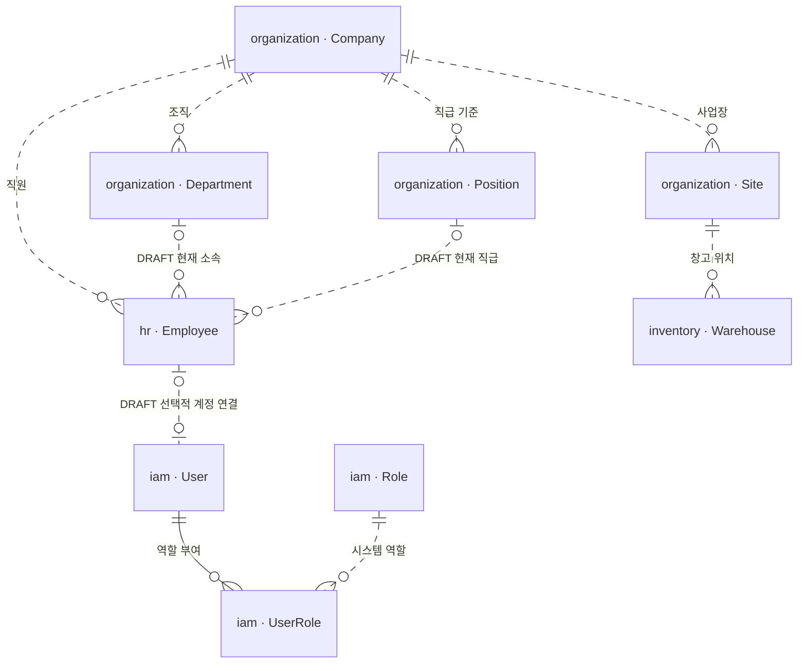
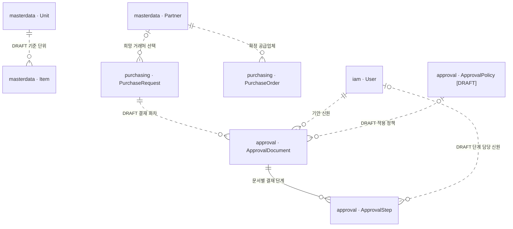
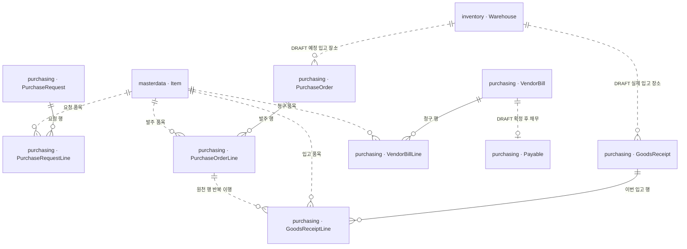
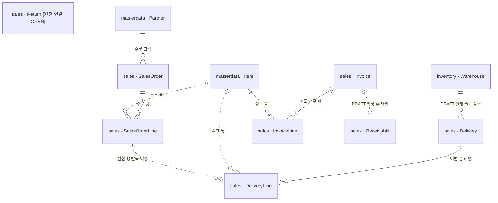
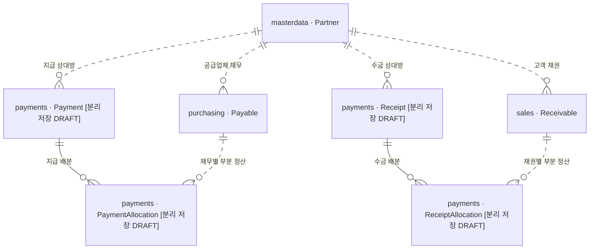
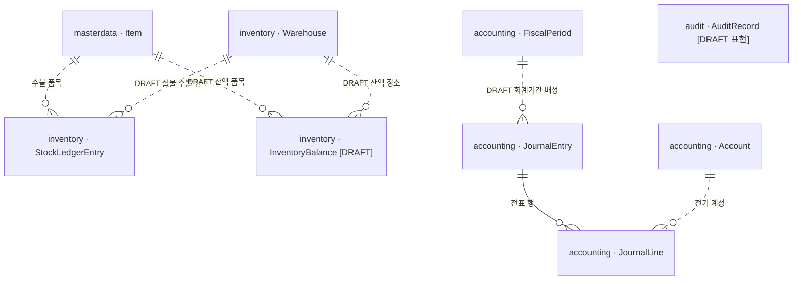
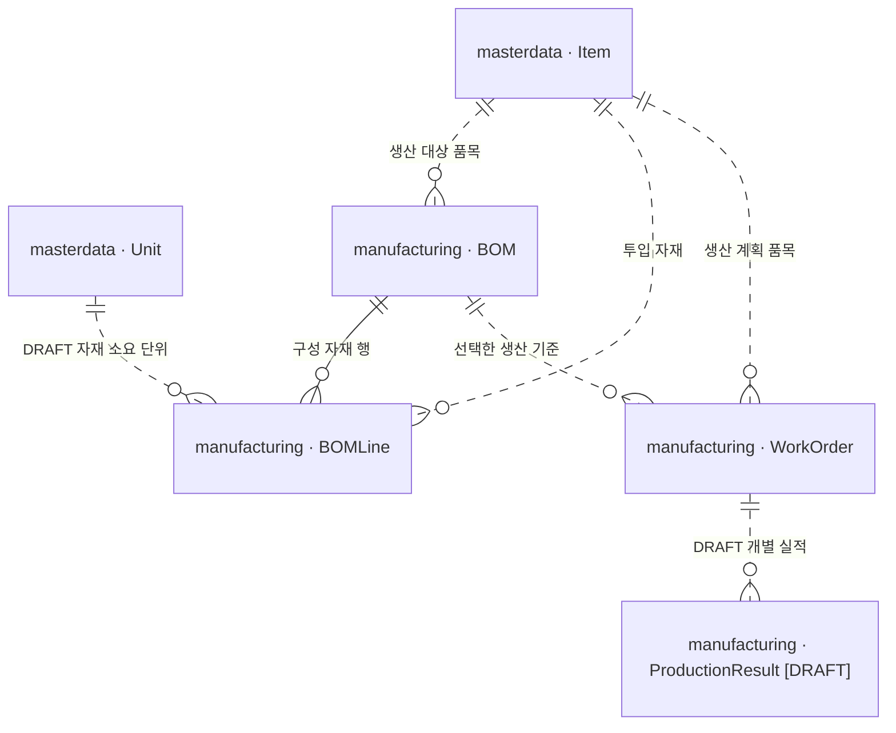

# K-Flow ERP ERD Overview v0.1

- 작성일: 2026-10-01
- 목적: 전체 ERP의 핵심 업무 Entity, 소유 Module, 주요 연결을 보여주는 **개념 데이터 지도**. 실제 DB나 Backend 구현 결과가 아니다.
- 입력: [REQUIREMENTS v0.2](../../REQUIREMENTS-v0.2.md), [Architecture v0.1](../architecture/architecture.md), 이번 사용자 지시의 Entity·관계 범위.
- 기준: DR-01/02/03/22 및 AQ-01 소유권 채택. 그 밖의 기존 미결 정책은 그대로 유지한다.
- 제외: 전체 컬럼·SQL 타입·JPA·Index·Unique Constraint·Version column·Lock·Idempotency key·Migration·Repository·Service·API·Controller·Spring 코드.

## 1. 지도를 읽는 방법

한 장에 모든 Entity를 밀어 넣지 않고 **7개 영역의 Mermaid erDiagram**으로 나눈다. 각 그림에서 `module · Entity`를 표시하며, 같은 이름이 다시 등장하면 동일 Entity를 재사용한 것이다. 다른 모듈에 복제한다는 뜻이 아니다.

- **확정 관계:** 사용자 채택 내용 또는 기존 목표 요구에서 확인된 업무 관계. 저장 구조·실행 시점·구체적 제약까지 확정하지 않는다.
- **[DRAFT]:** 구체적인 표현·연결 수의 검토 후보. Entity 이름이나 관계 옆에 표시한다.
- **[OPEN]:** 지원 범위나 연결 수를 정할 근거가 부족하다. 정확한 카디널리티를 임의로 그리지 않고 표와 질문으로 남긴다.
- `||`는 하나, `o|`는 0~1, `o{`는 0~여러 개, `|{`는 하나 이상이다. 문서→행의 0~여러 개는 초안까지 포함하는 지도 표현이다. 업무 확정에 필요한 최소 행 수를 0으로 허용한다는 정책이 아니다.
- 실선은 문서 내부의 구성 관계, 점선은 별도 업무 대상의 참조 관계를 표현한다. 선 모양은 채택 여부를 뜻하지 않는다. 참조 선은 물리적 FK, 객체 연관, 호출 방향이나 전파 삭제를 정한 것이 아니다.
- 모든 Entity와 **문서의 각 Line을 각각 Stable ID로 구별**한다. 이름·문서 표시번호·Item 식별만으로 원천 행을 대신하지 않는다. 이 지도에는 컬럼을 나열하지 않는다.

Business Use Case는 Architecture의 업무 시작 모듈이 조정한다. 데이터 지도의 선을 따라 타 모듈 Entity나 Repository를 직접 수정하는 구조로 해석하지 않는다.

## 2. Reference 확인과 K-Flow의 선택

참고 대상은 로컬 `ERPSystem-reference`의 commit `33b5df13594bcb456ba8a3d20e0bc455ac79aa75`다. [README ERD](https://github.com/q86865511/ERPSystem/blob/33b5df13594bcb456ba8a3d20e0bc455ac79aa75/README.md#-資料模型)와 [영문 README Data model](https://github.com/q86865511/ERPSystem/blob/33b5df13594bcb456ba8a3d20e0bc455ac79aa75/README.en.md#-data-model)을 먼저 읽고 관련 Domain 소스를 확인했다. 최신 원격 상태나 참조 프로젝트의 테스트 결과를 검증했다는 뜻은 아니다.

| [q868에서 확인한 것] | [K-Flow 요구와 다른 점] | [K-Flow ERD에서의 선택] |
| --- | --- | --- |
| README는 JournalEntry/JournalLine/Account, 문서/행, Item/StockLedgerEntry 등의 큰 관계를 표현 | K-Flow는 전자결재, 분리된 조직/직원/계정, 다수 사업장·창고를 함께 설명해야 함 | README의 관계 중심 표현만 참고하고 소유 Module을 모든 Entity에 표기 |
| [GrnLine](https://github.com/q86865511/ERPSystem/blob/33b5df13594bcb456ba8a3d20e0bc455ac79aa75/src/main/java/com/erp/purchasing/domain/GrnLine.java)은 원천 PO 행을, [DeliveryLine](https://github.com/q86865511/ERPSystem/blob/33b5df13594bcb456ba8a3d20e0bc455ac79aa75/src/main/java/com/erp/sales/domain/DeliveryLine.java)은 원천 SO 행을 식별 | K-Flow도 같은 품목의 서로 다른 주문 행과 반복 부분 이행을 구별해야 함 | PO Line→입고 Line, SO Line→출고 Line의 1:N을 유지. 원본 필드·타입·저장 매핑은 복사하지 않음 |
| [VendorBill](https://github.com/q86865511/ERPSystem/blob/33b5df13594bcb456ba8a3d20e0bc455ac79aa75/src/main/java/com/erp/purchasing/domain/VendorBill.java)과 [SalesInvoice](https://github.com/q86865511/ERPSystem/blob/33b5df13594bcb456ba8a3d20e0bc455ac79aa75/src/main/java/com/erp/sales/domain/SalesInvoice.java)에 청구 총액과 지급/수금 누계가 있음 | K-Flow 목표는 Payable·Receivable을 AP/AR 업무 개념으로 식별하며 소유권도 채택함 | Payable은 purchasing, Receivable은 sales. 별도 개념으로 표시하되 물리적 분리와 청구당 생성 개수는 DRAFT/OPEN |
| [Payment](https://github.com/q86865511/ERPSystem/blob/33b5df13594bcb456ba8a3d20e0bc455ac79aa75/src/main/java/com/erp/payments/domain/Payment.java)는 입출금 방향을 구분하고, [PaymentAllocation](https://github.com/q86865511/ERPSystem/blob/33b5df13594bcb456ba8a3d20e0bc455ac79aa75/src/main/java/com/erp/payments/domain/PaymentAllocation.java)은 지급/수금 대상 문서를 식별 | K-Flow는 Payment→Payable, Receipt→Receivable 배분을 명시해야 함 | 각각의 논리 Entity로 그려 부분 정산을 설명. 공통 Payment/Allocation 모델 채택 여부는 OPEN |
| [Warehouse](https://github.com/q86865511/ERPSystem/blob/33b5df13594bcb456ba8a3d20e0bc455ac79aa75/src/main/java/com/erp/masterdata/domain/Warehouse.java)는 masterdata에 있고, [ItemCostState](https://github.com/q86865511/ERPSystem/blob/33b5df13594bcb456ba8a3d20e0bc455ac79aa75/src/main/java/com/erp/inventory/domain/ItemCostState.java)는 품목별 현재 수량·원가 상태를 가짐 | K-Flow의 Warehouse는 inventory 소유. 복수 창고·평가 단위·품질 범위는 별도 검토 | Warehouse 소유권을 그대로 가져오지 않음. InventoryBalance는 DRAFT, 원가 상태 Entity와 평가 단위는 미확정 |
| [User](https://github.com/q86865511/ERPSystem/blob/33b5df13594bcb456ba8a3d20e0bc455ac79aa75/src/main/java/com/erp/iam/domain/User.java)는 Role 코드 집합을 문자열로 보관. README는 approval workflows를 유보 대상으로 기재 | K-Flow는 DR-22의 User/Employee·Position/Role 분리와 결재 연결이 핵심 | UserRole로 N:M 개념 표현. ApprovalDocument/Step과 정책 후보를 추가하고 원본 저장 형식을 채택하지 않음 |
| [WorkOrder](https://github.com/q86865511/ERPSystem/blob/33b5df13594bcb456ba8a3d20e0bc455ac79aa75/src/main/java/com/erp/manufacturing/domain/WorkOrder.java)는 BOM과 작업별 누적 생산을 참조. [ProductionLog](https://github.com/q86865511/ERPSystem/blob/33b5df13594bcb456ba8a3d20e0bc455ac79aa75/src/main/java/com/erp/manufacturing/domain/ProductionLog.java)는 설비·일자별 기록 | K-Flow의 작업별 실제 실적과 부분실적 지원 범위는 DR-18/19 후속 | ProductionResult를 작업 실적 후보로 구별. ProductionLog를 이름만 바꿔 복사하지 않음 |

## 3. Module별 핵심 Entity 목록

소유권은 AQ-01을 따른다. 아래 Entity는 개념이며 동일 개수의 물리 테이블을 만들겠다는 약속이 아니다.

| 소유 Module | 이번 지도의 핵심 Entity | 범위와 후보 표시 |
| --- | --- | --- |
| organization | Company, Site, Department, Position | 단일 법인, 장소와 조직 구분 |
| hr | Employee | 인사상 직원. Attendance/Leave/Payroll 상세 Entity는 이번 지도에서 생략 |
| iam | User, Role, UserRole | UserRole은 복수 역할의 논리 N:M 연결; 물리 표현 미정 |
| masterdata | Partner, Item, Unit | 거래처·품목·단위만 포함; 품목 역할별 허용 업무는 DR-01 유지 |
| approval | ApprovalDocument, ApprovalStep; ApprovalPolicy [DRAFT] | 정책 개념의 소유권은 확정, 별도 저장 Entity·버전 표현은 DRAFT |
| purchasing | PurchaseRequest, PurchaseRequestLine, PurchaseOrder, PurchaseOrderLine, GoodsReceipt, GoodsReceiptLine, VendorBill, VendorBillLine, Payable | Payable은 AP 보조부 개념. 청구와의 물리 분리/생성 개수는 미정 |
| payments | Payment, Receipt, PaymentAllocation, ReceiptAllocation | 지급·수금·배분 개념은 필요. 네 개의 독립 저장 Entity로 둘지는 [DRAFT] |
| inventory | Warehouse, StockLedgerEntry; InventoryBalance [DRAFT] | 현재고를 별도 저장할지, 집계할지와 집계 차원은 후속 |
| accounting | Account, FiscalPeriod, JournalEntry, JournalLine | GL은 accounting 소유. 이 지도에서는 전기된 전표·행의 회계 원장 관점으로 설명하며 별도 GL 저장 Entity는 추가하지 않음 |
| sales | SalesOrder, SalesOrderLine, Delivery, DeliveryLine, Invoice, InvoiceLine, Return, Receivable | Return의 원천 행·정산 연결은 OPEN, Receivable은 AR 보조부 개념 |
| manufacturing | BOM, BOMLine, WorkOrder; ProductionResult [DRAFT] | 계획/실적 분리는 목표. 실적 단위·부분 보고·WIP 근거 상세는 후속 |
| reporting | 원천 Entity 없음 | 각 소유 모듈의 공개 조회로 GL·AP·AR 등을 비교. Reconciliation은 별도 원장 소유자가 아님 |
| audit | AuditRecord [DRAFT 표현] | 감사 기록의 소유권은 확정. 저장 형태·거래 연결·필수 감사 실패 정책은 AQ-05/DR-25 후속 |
| assistant | 이번 단계에서 영속 Entity 추가 없음 | 권한 있는 조회와 확인된 초안 생성 조정. AI 대화 저장 구조를 임의로 추가하지 않음 |

## 4. 영역별 ERD

### 4.1 조직·장소·직원·로그인 계정

- **Company:** 한결 인더스트리라는 법인. 여러 Site가 같은 법인 안에 있다.
- **Site:** 본사·화성 생산·용인 물류 등의 장소. **Department:** 인사·업무 조직. **Warehouse:** 물리 재고 위치. Site와 Department는 서로 대체할 수 없으며, 사업장 간 이동도 법인 간 매출·매입이 아니다.
- Site→Department를 강제하지 않는다. 부서의 복수 사업장 활동, 직원의 겸직·전보 이력은 [OPEN E-01]이다.
- Employee와 User의 분리 및 직원에게 계정이 필수가 아니라는 것은 확정이다. 그림의 양쪽 0~1은 **연결 표현 후보**이며, 직원당 계정 수·직원 미연결 계정 허용 여부는 [OPEN E-02]다.
- User↔Role은 N:M이다. Position→Role 자동 부여 관계나 Role→ApprovalStep 자동 결재자 관계는 그리지 않는다.

### 4.2 공통 기준정보·결재

- PR의 희망 거래처는 PO의 확정 공급업체와 구분한다. Partner 이름이 같아도 Stable ID가 다르면 다른 대상이다.
- Item↔Unit의 기본 단위·거래 단위·BOM 단위환산을 혼동하지 않는다. 그림은 기준 단위 하나의 **후보**이며 다중 단위와 환산 범위는 [OPEN E-03]이다.
- ApprovalDocument는 결재가 판단하는 대상·회차를 표현하고, PR 등 업무 원본은 원래 소유 모듈에 남는다. PR을 approval로 옮기지 않는다.
- PR→결재 회차의 1:N, 정책 적용 관계, 단계당 담당 신원 표현은 [DRAFT]. 반려·재상신을 새 회차로 둘지, 병렬/합의/대결을 지원할지, 단계 담당자와 실제 처리자의 이력을 어떻게 보존할지는 [OPEN E-04]다. 고정 3단이나 User 한 명만 영구 고정하는 정책을 확정하지 않는다.
- 연차·지출결의 등 다른 결재 대상의 연결은 필요하지만 이번에 대상별 상세 Entity를 추가하지 않는다. 결재 완료는 ERP 후속 업무 완료와 별개다.

### 4.3 구매요청·발주·반복 부분입고·매입

**확정:** PO를 원천으로 하는 정상 입고에서는 각 GoodsReceiptLine이 특정 PurchaseOrderLine 하나를 식별하고, 한 PO Line에 여러 입고 Line이 연결된다. 같은 Item이 PO에 두 번 있어도 원천 행은 서로 다르다.

예시(설명용): 동일 Item의 PO 행 A=100EA, 행 B=50EA. 입고 문서 1의 행이 A의 30EA, 문서 2의 행이 A의 70EA라면 A의 확정 누계는 100EA이고 B는 0EA다. 두 입고가 초안이면 누계에 포함하지 않는다. 수량 값과 처리 상태가 없는 Entity 관계만으로 이 규칙이 자동 보장되는 것은 아니다.

**원천 연결의 표현 범위:**

| 후속 대상 | 참조해야 하는 근거 | 이번 판단 |
| --- | --- | --- |
| PurchaseOrderLine | 승인 근거가 되는 PurchaseRequestLine | 원천 행 추적 목표. 직접 발주·PR 분할/합산에 따라 연결 수가 달라져 그림의 선은 미확정 [OPEN E-05] |
| GoodsReceiptLine | PurchaseOrderLine의 Stable ID | PO 기반 정상 흐름에서 행별 반복 입고 1:N 확정. PO 없는 입고 예외는 미채택 |
| VendorBillLine | 실제 청구가 대응하는 PO 행 또는 확정 입고 행 | 원천 행 추적은 필요. 어느 원천을 직접 연결하고 합산/분할을 허용할지는 [OPEN E-06]. Item ID만으로 대체하지 않음 |

PO의 예정 창고와 GoodsReceipt의 실제 창고는 다른 업무 의미다. 그림은 **문서별 한 창고 후보**이며 행별 복수 창고를 지원할지는 [OPEN E-07]이다. 한 PO의 여러 입고는 Line 연결로 표현했으며, 여러 PO를 한 입고 문서에 모을 수 있다는 정책은 이번에 추가하지 않는다.

VendorBill→Payable의 **채무 발생 근거 관계**는 확정이고, 그림의 0~1은 **매입 한 건에 채무 한 건을 두는 후보**다. 매입 초안에서 채무를 생성하지 않는다. 별도 저장 여부, 분할 만기 또는 복수 채무 표현, 정정 방식과 회계 발생 시점은 [OPEN E-08]이다. 매입 확정과 회계의 구체적 연결은 DR-12/13 이후 결정한다.

### 4.4 판매주문·반복 부분출고·매출·반품

- SO 기반 정상 출고의 SalesOrderLine→DeliveryLine은 1:N이다. 주문 100EA에 서로 다른 확정 출고 40EA+60EA를 연결할 수 있다. 출고 초안은 이행 누계·현재고를 변경하지 않는다.
- InvoiceLine은 원천 SO/출고 행을 추적해야 한다. 출고·청구의 합산/분할 및 주문 없는 출고는 [OPEN E-09]로 두고 특정 연결 수를 강제하지 않는다. 동일 Item 중복 행도 원천 Line ID로 구분한다.
- Invoice→Receivable의 발생 근거를 구분하되 0~1 생성 관계는 [DRAFT E-08]. 청구 작성·매출 인식·AR 발생·COGS 인식을 같은 사건으로 정하지 않는다(DR-14).
- Return은 판매 소유의 핵심 업무 Entity다. 그림에서 고립돼 있는 것은 기능 제외가 아니라 **원매출/출고 행 및 AR 감액·기수금·환불/상계 연결 수가 미정**이기 때문이다. 원천 행별 반품 수량 추적은 요구사항이며, 이를 표현할 세부 행 구조와 정산 대상 관계는 [OPEN E-10]에서 다룬다. 반품 문서가 존재한다는 이유로 재고 복귀와 채권 감액이 동시에 끝났다고 보지 않는다.

### 4.5 지급·수금·채무/채권 배분

**확정된 업무 관계:** 배분 한 건은 지급 한 건과 채무 한 건을 연결한다. Payment 하나는 여러 Payable에 배분될 수 있고, Payable 하나는 여러 Payment에서 나누어 정산될 수 있다. 수금도 Receipt와 Receivable 사이에서 같은 부분 정산 관계를 가진다. 배분 Entity의 금액 상세 컬럼은 이번에 정의하지 않는다.

예시(요구사항 PAY-01): 채무 A=700,000원, B=400,000원에 지급 P=800,000원을 A에 600,000원, B에 200,000원 배분하면 각각 100,000원·200,000원이 남는다. 다음 지급이 남은 채무를 배분할 수 있다. 이는 시나리오 설명이며 실행한 테스트가 아니다.

그림의 배분 0~N은 **정산 전 대상/작성 단계까지 포함하는 표현**이다. 완료 지급에서 0건 배분을 허용한다는 뜻이 아니다. 현재 구매 지급 목표의 동일 거래처 배분·배분합계=지급액 조건을 유지한다. 선수선급·미배분액·환불·외부 금융 실행 범위는 기존 DR-15/16 미결이며 [OPEN E-11]이다.

분리된 네 이름은 업무 의미를 보여준다. q868처럼 방향을 가진 공통 Payment/Allocation으로 합칠지, 독립 모델로 유지할지는 [DRAFT/OPEN E-11]. 어느 쪽이든 AP 원본은 purchasing, AR 원본은 sales, 배분 원본은 payments다.
별 수불을 추적한다. 실물 수불의 창고 연결은 필요하지만 내부 가상 위치나 평가만의 조정까지 하나의 장소 구조로 표현할지는 [OPEN E-12]이므로 창고 관계를 DRAFT로 표시했다. InventoryBalance는 현재고 조회/보존을 위한 후보이며 **StockLedgerEntry와 별개로 마음대로 고치는 원본**이 아니다. 별도 저장 여부, 품목×창고 외 차원, 수량과 평가 집계 단위는 미정이다. Balance에 품목당 하나라는 관계를 강제하지 않는다.

**업무 Source ↔ StockLedgerEntry: 논리적 추적 관계 후보**

StockLedgerEntry에서 재고 증감을 발생시킨 실제 업무 사건과 그 원천을 추적하고, 원천 업무에서도 관련 수불을 확인할 수 있어야 한다. 아래는 Overview 수준의 **논리적 업무 Source 후보**다. 문서 초안이나 계획의 생성 자체가 수불 발생을 뜻하지 않으며, 실제 재고 처리의 확정 근거와 연결한다.

| 원천 업무 Source 후보 / 소유 Module | StockLedgerEntry로 추적할 업무 사건 | 기존 OPEN 범위 |
| --- | --- | --- |
| GoodsReceiptLine / purchasing | 해당 원천 행의 실제 입고 확정에 따른 입고 수불 | 발주 이행·검사 수량의 반영 시점, 평가와 회계 연결은 DR-07/10/13/20 유지 |
| DeliveryLine / sales | 해당 원천 행의 실제 출고 확정에 따른 출고 수불 | 예약·가용재고, 검사재고 출고, 평가 및 COGS 시점은 DR-09/10/14/20 유지 |
| WorkOrder / ProductionResult / manufacturing | 작업에 대한 실제 자재 불출 및 완제품 입고의 수불 근거 | 실제/자동 불출, 부분실적·추가투입·반납, WIP·원가·검사와 입고 연결은 DR-10/18/19/20 유지. 작업 계획이나 실적 기록만으로 입고를 완료 처리하지 않음 |
| Return / sales | 반품 검수·실물 복귀 등 채택한 반품 재고 처리 사건 | 검수 시점, 가용/불량 재고 구분, 평가·채
### 4.6 재고장·현재고·회계 원장

**확정:** JournalEntry는 JournalLine을 가지며 각 행은 Account를 식별한다. 전표 초안까지 포함해 행 0~N을 그렸지만, 전기 시 유효 분개와 차대 합계 검증은 ACC-01의 목표다. FiscalPeriod와의 귀속은 필요하되 초안/전기 시 배정 시점과 기간 세부 정책은 [DRAFT E-13]이다.

StockLedgerEntry는 실제 확정된 재고 증감의 근거다. Item권 정정과의 처리 순서는 DR-10/15/20 유지 |
| Inventory Transfer / inventory — 논리적 업무 Source 후보 | 창고 이동의 출발·도착 또는 장부대체에 따른 이동 수불 | 즉시 이동 또는 운송중 모델, 부분 도착·손실·취소 및 재고 차원은 DR-10/20/21 유지 |
| Inventory Adjustment / inventory — 논리적 업무 Source 후보 | 실제 재고조정 확정에 따른 증가·감소 수불 | 조정 근거·승인·대상 재고 구분과 평가 반영 상세는 INV-02 및 DR-10/20의 후속 설계로 유지 |

**물리 FK와 카디널리티는 확정하지 않는다.** 원천 문서/행 하나가 수불 하나에 대응한다고 가정하지 않으며, 원천의 연결 단위·저장 방식·생성 시점은 해당 업무 상세설계에서 정한다. 평가법, 검사 시점, WIP, 반품 검수, 이동 모델은 기존 OPEN 상태 그대로다.

Inventory Transfer / Adjustment는 현재 Entity 목록에 없는 **논리적 업무 Source 후보로만 표시**한다. 신규 확정 Entity나 공통 Source Entity를 추가하지 않는다. 위 연결을 나타내기 위해 기존 Mermaid에 임의 카디널리티의 관계선을 넣지 않는다.

**업무 Source ↔ JournalEntry: 논리적 추적만 표현**

아래 연결은 구체적 연결 수·발생 시점이 아직 미정이어서 Mermaid의 특정 카디널리티로 고정하지 않는다. 공통 `BusinessDocument` Entity나 범용 Source 테이블을 새로 만든다는 뜻이 아니다.

| 원천 업무 대상 / 소유 Module | 논리적 연결 대상 | 미결 범위 |
| --- | --- | --- |
| GoodsReceipt, VendorBill / purchasing | JournalEntry / accounting | 입고·매입 중 어떤 사건이 언제 전기되는지 DR-12/13 |
| Delivery, Invoice, Return / sales | JournalEntry / accounting | 매출·COGS·반품 정정의 전기 사건 DR-14/15 |
| Payment, Receipt / payments | JournalEntry / accounting | 정산·정정의 회계 근거 및 범위 DR-12/16 |
| WorkOrder, ProductionResult / manufacturing | JournalEntry / accounting | 제조원가·WIP의 전기 근거 DR-19 |
| StockLedgerEntry / inventory | JournalEntry / accounting | 재고 수량 변동과 회계 반영의 대응 여부·단위 DR-10/13/19 |

업무 Source를 찾아갈 수 있어야 한다는 목표만 유지한다. 하나의 문서=전표 하나, 하나의 재고 행=전표 하나를 확정하지 않는다. **구체적인 FK·Idempotency key 구조를 정의하지 않는다.**

GL은 accounting 소유이고, purchasing의 AP Subledger 및 sales의 AR Subledger와 구별된다. Reporting/Reconciliation은 공개 조회로 GL과 각 보조부를 비교하며 어느 원장도 중복 소유하지 않는다. 조회 기준 시점·과거 잔액 재구성은 AQ-06 후속이다.

AuditRecord는 감사 기록 개념의 후보 표시다. 행위자 신원과 대상 거래를 추적해야 하지만 대상 연결 형식·카디널리티, 필수 기록의 실패 처리까지 확정한 것은 아니다. 따라서 이번 그림에서는 특정 거래와 강제 연결하지 않는다 [OPEN E-14].

### 4.7 생산 기준·작업지시·실제 실적

- BOM→BOMLine→Item은 생산품과 투입 자재를 구별한다. WorkOrder는 사용할 BOM 기준을 식별한다. 선택한 기준의 버전/당시 값을 재현해야 하지만, 버전별 Entity 분리나 Snapshot 필드는 확정하지 않는다 [OPEN E-15].
- DR-01의 v1 품목 역할을 유지한다. 현재 Mock에서 S-200을 작업지시에 쓰는 모습은 자체 생산 정책의 근거가 아니며, 이 ERD가 그러한 사용을 허용하는 것도 아니다.
- 계획수량과 실제 실적은 별도 업무 사실이다. WorkOrder→ProductionResult의 1:N은 부분 보고를 표현할 수 있는 **후보**이며 부분실적 지원을 채택한 것은 아니다. 실적 기록 단위, 양품/불량·추가투입·반납·잔여 WIP 범위는 DR-18/19 이후 확정한다.
- 양품 실적과 완제품 창고 입고도 별개 사실이다. 재고 확정과 연결될 필요는 있지만 생산 입고의 상세 문서/행 및 실적과의 연결 수는 이번에 추가하지 않는다. WIP를 별도 저장 Entity로 확정하거나 계획 잔량을 WIP로 간주하지 않는다.

## 5. 확정 관계와 남겨 둔 경계

| 확정한 업무 관계 | 남겨 둔 상세 |
| --- | --- |
| 단일 Company, 복수 Site와 Warehouse; Department는 조직, Warehouse는 재고 장소 | 부서/사업장 배치와 직원 겸직·이력 |
| Employee와 User 분리, 계정 없는 직원 허용, User↔Role N:M | 직원/계정 연결 수, 계정 예외 및 역할 부여 저장 형식 |
| 문서별 Line 식별과 Item Stable ID 참조 | Line의 구체적 저장 식별 형식·Snapshot |
| PO Line→GoodsReceiptLine 반복 부분입고 1:N | PO 없는 입고·초과·잔량취소·합산 입고 문서 범위 |
| SO Line→DeliveryLine 반복 부분출고 1:N | 주문 없는 출고·합산 문서·초과/잔량취소 |
| VendorBill은 Payable의 발생 근거, Invoice는 Receivable의 발생 근거 | 발생 사건, 청구당 생성 개수, 분할 만기 및 물리 저장 분리 |
| Payment→Allocation→Payable, Receipt→Allocation→Receivable의 부분·복수 정산 | 공통화, 미배분·선수선급·환불·정정 |
| JournalEntry→JournalLine→Account와 원천 업무 추적 | Source 연결 수/저장 방식·전기 사건·시점 |
| BOM→BOMLine→Item, WorkOrder→BOM의 생산 기준 | BOM 버전 표현, 부분실적·WIP·생산 입고 연결 |
| 결재 대상과 Step을 구분하고 승인과 ERP 후속 실행을 분리 | 정책·회차·병렬/대결·실제 처리 이력의 구조 |

## 6. 상세 ERD 전에 결정할 DRAFT / OPEN 질문

아래 E 번호는 이 문서의 질문 식별자이며 새로운 채택 DR이나 구현 지시가 아니다. 관련 도메인의 상세 ERD를 작성하기 전에 해당 질문을 순서대로 해결한다.

| ID | 상태 | 결정할 질문 | 연결된 기존 요구/결정 |
| --- | --- | --- | --- |
| E-01 | OPEN | 부서와 사업장의 관계, 직원의 단일 소속·겸직·전보 이력과 직급 배정은 어떻게 표현하는가? | DR-02/22, HR-01 |
| E-02 | DRAFT / OPEN | Employee↔User의 최대 연결 수, 직원 미연결 계정 범위, UserRole 저장 표현은? 직원의 User 보유는 여전히 필수가 아님 | DR-22 |
| E-03 | DRAFT / OPEN | Item의 기본 단위와 거래/BOM 단위, 환산 지원 범위는? | DR-04, QTY-01 |
| E-04 | DRAFT / OPEN | 결재 대상·회차·재상신·정책 버전·단계 담당자/실제 처리자, 병렬/대결은 어떻게 표현하는가? | DR-17, APR-01~03, AQ-02/04 |
| E-05 | OPEN | PR 분할/합산 발주, 직접 발주, PO 없는 입고 및 입고 문서 합산을 어디까지 허용하는가? 원천 Line 연결 수는? | DR-06/07, PUR-01/02/04 |
| E-06 | OPEN | VendorBillLine의 원천을 PO/입고 중 어떻게 연결하고 분할/합산 청구를 허용할 것인가? | DR-08/13, PUR-03 |
| E-07 | DRAFT / OPEN | 예정/실제 입출고 창고를 문서 단위로 둘지 행별로 나눌지, 차이 처리 범위는? | DR-07/09/20, 구매 PF-02는 채택 여부 구분 |
| E-08 | DRAFT / OPEN | 청구 한 건과 Payable/Receivable의 개수, 분할 만기·정정, 물리 분리 및 발생 시점은? | DR-08/09/12/13/14 |
| E-09 | OPEN | InvoiceLine의 SO/출고 원천 관계와 합산/분할 청구, 주문 없는 출고 범위는? | DR-09/14, SAL-01/02 |
| E-10 | OPEN | Return의 원매출/출고 행, AR 감액·기수금·환불·상계 연결과 처리 순서는? | DR-15/16/20 |
| E-11 | DRAFT / OPEN | 지급·수금과 배분을 공통화할지 분리할지, 미배분·선수선급·환불·정정 범위는? | DR-16, PAY-01; 기존 구매 배분 검증 유지 |
| E-12 | DRAFT / OPEN | InventoryBalance를 저장하는가? 창고/품목 외 필요한 재고 차원과 평가 단위, 수불 Source는? | DR-10/20/21, INV-01/02 |
| E-13 | DRAFT / OPEN | 회계기간 귀속과 원천 업무↔전표의 연결 단위, 각 사건의 회계 인식 시점은? | DR-12/13/14/19, AQ-03 |
| E-14 | DRAFT / OPEN | 감사 기록의 대상·행위자 연결과 보존, 필수 감사 저장 실패 시 업무 성공 여부는? | DR-23/25, AQ-05 |
| E-15 | DRAFT / OPEN | BOM 기준 재현, ProductionResult 기록 단위·부분실적, 자재 투입·WIP·완제품 입고 연결 범위는? | DR-03/04/18/19 |

QC/LOT/Serial, Payroll 상세 Entity 및 계산 구조는 이번에 확정하지 않는다. 기존 정책이 확정되지 않았다는 이유로 Entity를 임의로 늘리거나 이번 지도에서 지원 완료로 표시하지 않는다. API·트랜잭션·성능 측정도 이번 범위가 아니다.

## 7. 작성 검증 범위

- Architecture는 4.1절의 GL/AP/AR 소유권과 대사 표현 한 곳만 수정한다. REQUIREMENTS와 Frontend 및 Backend 코드는 수정하지 않는다.
- 사용자 지정 핵심 Entity 44개가 그림에 포함됐음을 확인했다. 후보를 포함한 전체 개념은 47개이며, 소유 Module·반복 부분 이행·배분·전표·생산 기준 및 DRAFT/OPEN 표시를 점검했다.
- Mermaid erDiagram 7개를 임시 Mermaid 렌더러와 Chrome에서 문법 검사·실제 렌더링했다. 모두 통과했다. 검증 의존성과 렌더링 결과는 임시 폴더에만 두며 프로젝트 의존성은 변경하지 않았다. DB·Backend 업무 테스트나 미정 정책의 채택을 뜻하지 않는다.
