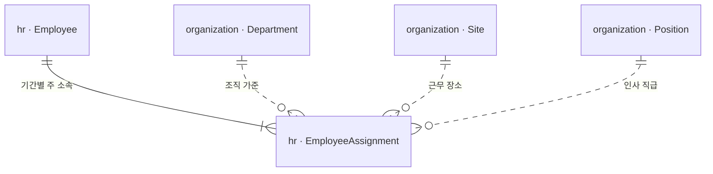
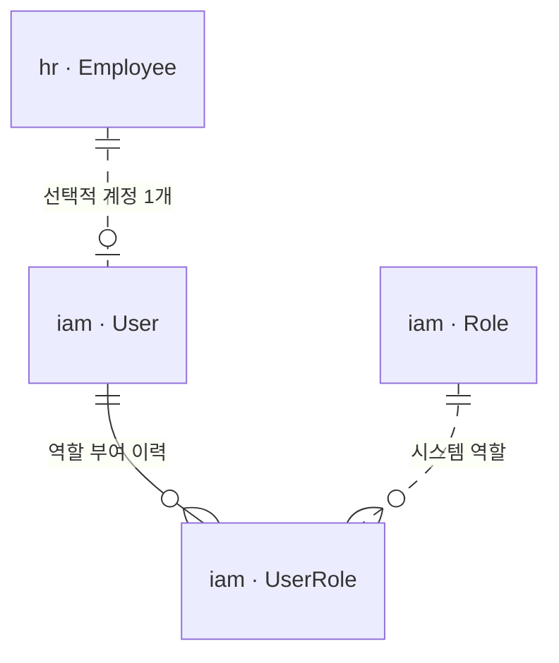

# Organization + HR Core(Employee/EmployeeAssignment) + IAM Detailed Design v0.1

- 작성일: 2026-10-03 (Asia/Seoul)
- 상태: **E-01/E-02 CLOSED — 사용자 채택 정책 반영 / 상세 구조 DESIGN v0.1 / 구현 미착수**
- 기준 Repository: `kimini02/k-flow-erp`
- 읽은 기준 브랜치/커밋: `codex/backend-foundation` / `1e9e2c6a64f0bfdd13b6314f49700c6c2ba9fbf5`
- 기준 문서: [Requirements v0.2](../../REQUIREMENTS-v0.2.md), [Architecture v0.1](../architecture/architecture.md), [ERD Overview](../domain/erd-overview.md), [E-01/E-02 결정 기록](../adr/0001-organization-employee-account-boundaries.md)
- 현재 구현 근거: [Backend Foundation 검증 기록](../test-evidence/backend-foundation.md). Foundation 및 원격 CI 완료와 이번 업무 설계/테스트 완료를 구분한다.
- 이번 산출물은 설계 문서다. Java 업무 코드, SQL Migration, Frontend 변경, JWT/Lock/Idempotency 구현 및 Astra 구현 지시는 추가하지 않는다.

## 1. 정책 확정과 설계안의 구분

| 표기 | 의미 |
| --- | --- |
| ADOPTED | 2026-10-03 사용자가 채택한 정책 또는 기존 DR-02/03/22·AQ-01 원칙. 다시 선택 대기로 돌리지 않는다. |
| DESIGN v0.1 | 정책을 만족시키기 위해 이번에 제안한 책임·상태명·테이블·제약·Port 계약·API 후보. 기존 사용자 채택 사실로 소급하지 않는다. |
| OPEN | 이번 채택에 포함되지 않았거나 사용자가 명시적으로 남겨 둔 후속 결정. 미정 값을 코드 기본값으로 메우지 않는다. |

E-01/E-02의 CLOSED는 **원래 질문의 정책 결정 완료**다. 전체 HR, 인증 방식, 도메인별 권한표, 감사 실패 정책 또는 구현 준비 완료를 뜻하지 않는다.

### 1.1 채택한 정책

| 영역 | ADOPTED 내용 |
| --- | --- |
| 회사/장소 | 단일 법인 한결 인더스트리. 복수 Site와 Warehouse. Department·Site·Warehouse는 별개. 다법인 v1 제외. |
| 조직/직급 | Department와 Site 독립. Position은 회사 공통 인사 직급이며 Department에 종속시키지 않는다. |
| 직원 소속 | 재직 중 현재 주 Department·Site·Position 각각 1개. 동시 겸직 v1 미지원. |
| 인사 이력 | HR 소유 EmployeeAssignment에 기간별 소속·사업장·직급 이력을 보존한다. |
| 직원/계정 | Employee는 User 0..1개. v1의 사람 User는 Employee 정확히 1명과 연결. 직원 미연결 사람 계정·복수 계정 미지원. |
| 역할 | User↔Role N:M. UserRole을 명시적 연결 Entity/Table로 둔다. CSV 문자열 저장을 사용하지 않는다. |
| 권한 결합 | 유효한 Allow 권한의 합집합. 명시적 DENY 권한/Role v1 미지원. 권한 부재에 따른 접근 거부는 DENY Role을 만든다는 뜻이 아니다. |
| 퇴사 | Employee/User와 과거 거래·결재·감사 참조 보존. 퇴사자는 로그인 비활성화. |
| Data Scope | User 전역 Scope를 두지 않는다. 업무/권한별로 달라질 수 있다는 원칙까지만 채택. |
| 결재 경계 | Position만으로 권한을 부여하지 않고 APPROVER Role만으로 실제 결재자를 결정하지 않는다. 실제 담당자/대결 정책은 Approval 후속 설계. |

### 1.2 이번에 확정하지 않는 것

- Data Scope의 구체 저장 구조/Scope 표는 도메인별 후속 결정이다. Permission/Scope 연결 테이블, Scope enum 및 복수 Scope 결합 규칙도 이번에 확정하지 않는다.
- 휴직 시 신규 로그인·기존 세션 접근 정책. Employee의 휴직과 User의 접근 상태를 같은 상태로 합치지 않는다.
- 인증 수단(Session/JWT/SSO 등), 비밀번호·초대·초기 관리자·잠금·복구/세션 철회 기술.
- 급여·근태·연차 계산과 DR-24, 결재선과 DR-17/E-04, 필수 감사 실패 정책과 DR-25/E-14.

## 2. Entity 책임과 모듈 경계

| 소유 Module | Entity | 책임 | 소유하지 않는 것 |
| --- | --- | --- | --- |
| organization | Company | 한 법인의 Stable ID와 표시/법인 기본정보 | 법인별 별도 테넌트 운영, 직원 계정 |
| organization | Site | 본사·생산·물류 등 근무/업무 장소 기준 | Warehouse 재고·직원 소속 이력 |
| organization | Department | 회사 조직 기준 | Site 소속 강제, 직원 인사 이력, 결재자 자동 결정 |
| organization | Position | 회사 공통 직급 기준 | Role, 권한, 실제 결재선 |
| hr | Employee | 직원 신원, 회사·사번, 재직 상태/기간의 원본 | 로그인명·Credential·Role, 조직 기준 정의 |
| hr | EmployeeAssignment | 직원별 Department/Site/Position의 유효 기간 이력 | 겸직, 계정 권한, 조직 기준의 원본 |
| iam | User | 로그인 주체, Employee 연결, 관리자가 정한 계정 접근 상태 | 직원 재직 상태의 별도 원본, 급여/근태 |
| iam | Role | 시스템 행위 권한을 묶는 역할 식별/상태 | 직급, 전역 Data Scope, 실제 결재자 |
| iam | UserRole | 누구에게 어떤 Role이 부여/철회됐는지 명시적 연결 | Scope 저장, Permission 매핑표의 선결정 |

**읽기/호출 방향:** `iam → hr::api, organization::api`, `hr Core → organization::api`. Organization은 HR/IAM을 호출하지 않는다. HR Core는 IAM·Approval·Accounting을 호출하지 않는다. 이후 연차/급여 의존은 해당 업무가 추가될 때 별도로 다룬다.

다른 모듈의 JPA Entity/Repository를 import하거나 객체 연관으로 탐색하지 않는다. 모든 교차 참조는 Stable ID와 최소 Published DTO를 사용한다. 물리 FK 후보와 Java 의존은 별개다(5.3절).

## 3. 관계와 현재 소속의 원본

### 3.1 HR Core

Company→Site/Department/Position/Employee는 같은 단일 법인 참조다. Department↔Site 연결 테이블이나 Department.siteId는 만들지 않는 설계안이다. Warehouse는 Inventory의 별도 후속 설계 대상이다.

**DESIGN v0.1:** EmployeeAssignment를 현재 소속과 과거 소속의 단일 원본으로 한다. Employee에 현재 departmentId/siteId/positionId를 따로 저장하지 않는다. 조회 DTO에는 계산된 현재 ID를 담을 수 있다. 나중에 캐시/Projection을 두더라도 수정 가능한 두 번째 원본으로 만들지 않는다.

### 3.2 IAM

User는 Employee 없이는 생성하지 않는다. 계정 비활성화 후에도 employeeId의 유일성을 유지한다. 퇴사자의 연결을 제거해 다른 직원에게 계정을 재활용하지 않는다. 재입사 처리는 10절의 후속 정책이다.

## 4. 상태·기간·비활성화

### 4.1 Organization 상태 — DESIGN v0.1

| 대상 | 상태/동작 후보 | 신규 선택과 기존 참조 |
| --- | --- | --- |
| Company | v1 법인 1개 유지. 일반 사용자의 추가/삭제/비활성화 API 제외 | 회사 정보 변경은 법인 ID를 교체하지 않는다. |
| Site/Department/Position | ACTIVE ↔ INACTIVE | INACTIVE는 신규 소속 배정에서 선택 불가. 과거 참조와 표시용 조회는 유지. |

코드/이름을 참조 ID로 사용하지 않는다. 표시명 변경은 Stable ID를 유지한다. 업무 이력이 있는 기준정보의 Hard Delete와 참조 전파 삭제는 제공하지 않는다.

**비활성화 의미의 추천:** 기존 EmployeeAssignment는 보존하고 직원 퇴사/계정 차단/Role 회수로 전파하지 않는다. 현재 소속이 비활성 기준을 참조한다는 이유로 IAM이 자동 차단하지 않는다. 즉시 재배치 강제 여부는 OPEN OHI-03이며, 이번 설계안에서는 상태 변경과 재배치를 독립 명령으로 둔다. 기존 업무 문서의 후속 처리는 해당 도메인의 비활성 기준정보 정책을 따른다.

### 4.2 Employee 상태 — DESIGN v0.1

| 상태 후보 | 의미 | Assignment | IAM과의 연결 |
| --- | --- | --- | --- |
| EMPLOYED | 재직 중 | 현재 날짜에 정확히 1개 | 계정 관리 상태와 행위 권한을 별도 확인 |
| ON_LEAVE | 휴직 중 | 주 소속 유지가 추천안 | 로그인 허용/차단 **OPEN**. 상태만 전달 |
| TERMINATED | 퇴사 효력 발생 | 재직 종료까지의 이력 보존, 종료 이후 현재 소속 없음 | 로그인 및 이후 인증된 요청 차단 |

인사 상태 후보 전이는 EMPLOYED→ON_LEAVE→EMPLOYED, EMPLOYED/ON_LEAVE→TERMINATED다. 휴직 시작/복귀 명령의 API·권한·접근 영향은 OHI-02 결정 전 구현 준비 완료로 보지 않는다. TERMINATED의 재입사 전이는 OHI-04 후속이다.

퇴사 효력일의 추천 의미는 **직원으로 일하지 않는 첫 날짜**다. 재직 기간은 `[joinedOn, terminationEffectiveOn)`이다. 마지막 근무일을 UI에서 받는다면 그 다음 날짜로 변환해야 하므로 입력 용어를 섞지 않는다. 휴직 기간·퇴사 예약/소급 입력 정책은 별도 OPEN이다.

### 4.3 EmployeeAssignment 기간 — DESIGN v0.1

- `effectiveFrom` 포함, `effectiveTo` 제외의 `[from, to)` 날짜 구간. 끝이 없으면 `effectiveTo = null`.
- 현재 소속은 `effectiveFrom ≤ 기준일 < effectiveTo`(끝이 없으면 무한대)를 만족하는 행이다. `effectiveTo IS NULL`만으로 현재를 찾지 않는다.
- 회사 업무 날짜의 추천 기준은 Asia/Seoul, 기록 시각은 UTC Instant. 기준 시계/시간대를 한 요청에서 일관되게 사용한다.
- 재직 기간의 어느 날짜든 Department·Site·Position이 모두 지정된 Assignment가 정확히 1개여야 한다. 중복 금지와 공백 금지를 각각 검증한다.
- 최초 Assignment의 시작은 joinedOn과 일치시키는 추천안이다. 중도 데이터 이관으로 과거 소속을 알 수 없는 경우 현재 값을 과거 전체에 임의 적용하지 않고 별도 초기 이관 정책을 정한다.
- Assignment에 별도 ACTIVE 상태를 저장하지 않는다. 아직 끝나지 않은 기간과 현재 날짜에 유효한 기간은 같은 뜻이 아니다.
- 퇴사에서는 마지막 Assignment의 끝을 퇴사 효력일로 닫고 이력을 남긴다. 계정 없는 직원도 동일하다.

설명 예시: `[2026-01-01, 2026-07-01)`은 본사/구매팀/대리, `[2026-07-01, 무기한)`은 화성/구매팀/과장이다. 7월 1일에는 두 번째 소속만 유효하다.

기간 모델 자체는 과거/미래 조회를 표현할 수 있다. **예약 전보·소급 전보·완료 이력 정정의 입력 허용 범위는 OHI-01 OPEN**이며, 기간 표현이 있다는 이유로 무제한 수정 API를 열지 않는다. 초기 구현 범위의 추천은 등록 시 초기 소속 + 당일 전보/승진 + 당일 퇴사다. 이것은 추가 채택 정책이 아니라 설계 추천이다.

Assignment가 보존하는 것은 **당시 참조한 ID와 유효 기간**이다. 조직명·직원명 변경 전체를 자동 복원하는 모델은 아니다. 확정 문서의 당시 표시값은 그 문서 소유 모듈이 확정 시 최소 Snapshot으로 보존한다. 현재 조직명을 붙인 과거 조회를 당시 이름이라고 표시하지 않는다.

### 4.4 User·Role·UserRole — DESIGN v0.1

| 대상 | 상태/표현 후보 | 처리 원칙 |
| --- | --- | --- |
| User | ENABLED / DISABLED의 관리 상태 | 임시 보안 잠금·Credential 상태와는 다른 개념. 사유·변경자·시각을 보존 |
| Role | ACTIVE / INACTIVE | 직급과 독립. 비활성 Role을 신규 부여하지 않음 |
| UserRole | 부여 1회당 한 행. revokedAt이 없으면 미철회, 있으면 철회 | 철회 시 삭제하지 않고, 재부여는 새 행. 동일 User/Role의 미철회 연결은 최대 1개 |

계정 생성 초기 상태는 DISABLED 추천안이며 Credential 준비/활성화 절차는 OHI-06 후속이다. Role이 0개인 User의 업무 권한은 0개다. 로그인만으로 업무 관리 권한을 획득하지 않는다.

Role 비활성화의 추천안은 **Role 상태 변경과 그 Role의 미철회 UserRole 철회를 IAM 내부 한 트랜잭션에서 처리**하는 것이다. 재활성화만으로 과거 권한이 되살아나지 않는다. 이 lifecycle은 DESIGN v0.1이며 사용자 채택 정책으로 소급하지 않는다. 계정 일시 비활성화 때 Role 연결을 유지할지 등 재활성화 정책은 OHI-05에 남긴다.

**유효 접근은 관리 상태와 재직 상태를 함께 본다.** 퇴사 후 User 행을 ENABLED로 바꾸는 요청으로 퇴사 차단을 우회할 수 없다. ON_LEAVE를 TERMINATED와 묶거나 `status != EMPLOYED`라는 식으로 로그인 차단을 자동 구현하지 않는다.

## 5. 핵심 저장 구조와 DB Constraint 후보

테이블명, UUID 식별자, version 필드는 **DESIGN v0.1**이다. 실제 SQL/Migration/JPA 매핑은 작성하지 않는다. 업무 코드는 표시번호가 아니라 Stable ID로 연결한다. v1 단일 법인에서도 잘못된 법인 참조를 막기 위해 companyId 일치를 검증한다.

### 5.1 최소 필드 책임

| 테이블 후보 | 최소 필드군 | 원본/주의 |
| --- | --- | --- |
| org_company | id, singletonKey, code, name, version, 생성/변경 시각 | singletonKey 제약으로 두 번째 법인 금지 |
| org_site | id, companyId, code, name, status, version, 변경 근거 | Warehouse 필드·소속 직원 목록을 저장하지 않음 |
| org_department | id, companyId, code, name, status, version, 변경 근거 | siteId 없음. 계층/부서장 필드는 OHI-07 후속 |
| org_position | id, companyId, code, name, status, version, 변경 근거 | departmentId, roleId 없음 |
| hr_employee | id, companyId, employeeNo, name, employmentStatus, joinedOn, terminationEffectiveOn, version, 변경 근거 | departmentId/siteId/positionId의 별도 현재 원본 없음 |
| hr_employee_assignment | id, companyId, employeeId, departmentId, siteId, positionId, effectiveFrom, effectiveTo, 기록/변경 근거 | 인사 유효 날짜와 기록 시각 구분 |
| iam_user | id, companyId, employeeId, loginKey, accountStatus, version, 변경 근거 | 전역 scope 없음. Credential의 물리 표현은 OHI-06 |
| iam_role | id, companyId, code, name, status, version, 변경 근거 | Permission/Scope 저장 필드를 미리 만들지 않음 |
| iam_user_role | id, companyId, userId, roleId, grantedAt/By, revokedAt/By, reason, version | 부여·철회 이력. 개별 Permission 또는 Scope 저장 아님 |

기관명/사번/로그인명 정규화 및 허용 문자·길이는 구현 계약 확정 때 고정한다. 추천은 코드/로그인 식별 키의 정규화값에 유일 제약을 걸고 비활성화 후에도 키를 재사용하지 않는 것이다. 대소문자 처리·키 변경 정책은 OHI-08이다. 이름 자체의 중복을 금지하지 않는다.

### 5.2 보장할 제약과 보장하지 못하는 것

| ID | 대상 | DB Constraint 후보 | Application에서 별도로 확인할 것 |
| --- | --- | --- | --- |
| DB-01 | Company | PK(id), singletonKey NOT NULL·UNIQUE·고정값 CHECK | 초기 회사 생성 경로/관리 권한. 둘 이상의 법인 지원 금지 |
| DB-02 | Site/Department/Position/Role | companyId FK, UNIQUE(companyId, normalizedCode), 필수 이름·코드·상태 NOT NULL/CHECK | 생성/비활성화 권한, 정상 상태 전이 |
| DB-03 | Employee | UNIQUE(companyId, normalizedEmployeeNo), companyId FK, 필수 신원/상태/입사일 | 재직 상태와 날짜 일치, 재입사/정정 정책 |
| DB-04 | Employee 날짜 | terminationEffectiveOn이 있으면 joinedOn보다 큼; TERMINATED에 종료일 필요라는 행 내부 CHECK 후보 | 미래 예약 퇴사와 상태 반영 시점은 OPEN. 다른 Assignment 행과의 일치 검증 |
| DB-05 | Assignment | 모든 참조/시작일 NOT NULL, 끝은 NULL 또는 시작보다 큼 | 재직 기간 밖 배정 금지, 휴직 시 소속 유지 정책 |
| DB-06 | Assignment | 같은 employeeId의 유효 구간이 겹치지 않는 EXCLUDE 후보 | **공백 없음·최초/최종 경계는 EXCLUDE만으로 보장되지 않음** |
| DB-07 | User | employeeId NOT NULL, UNIQUE(employeeId), Employee 참조 FK | 직원 존재/회사 일치·퇴사 상태·계정 생성 권한, 동시 퇴사와의 검증 |
| DB-08 | User | 정규화 loginKey UNIQUE, 상태 NOT NULL/CHECK | Credential·인증 정책, 비활성화 후 중복 키 재사용 금지 |
| DB-09 | UserRole | User/Role FK, 미철회 행의 UNIQUE(userId, roleId) partial index | 부여권자 검증, 활성 Role 확인, grant/revoke 순서·버전 |
| DB-10 | UserRole 시각 | revokedAt은 NULL 또는 grantedAt 이상; 철회 시각/행위자 짝 검증 후보 | 최초 bootstrap의 신뢰 가능한 행위자 표현은 OPEN |
| DB-11 | 모든 참조 | ON DELETE RESTRICT/NO ACTION, 전파 삭제 제외 | 공개 API에서 Hard Delete를 제공하지 않음 |
| DB-12 | 변경 가능한 원본 | version NOT NULL, 행 내부 유효값 CHECK | 비교 후 갱신 및 충돌 응답. version 컬럼 존재만으로 Lost Update가 막히지 않음 |

기간 중복의 후보 표현은 `employee_id WITH =`와 `daterange(effective_from, effective_to, '[)') WITH &&`를 결합한 GiST EXCLUDE다. `btree_gist` 사용 가능 여부는 실제 PostgreSQL 16 환경에서 검증한다. 확장 설치/운영 제약이 있으면 오류와 대안을 보고하고 제약을 조용히 제거하지 않는다. [PostgreSQL 16 공식 Range Constraints](https://www.postgresql.org/docs/16/rangetypes.html#RANGETYPES-CONSTRAINT)

기간 공백, 다른 행의 상태, 타 테이블 ACTIVE 여부를 일반 CHECK의 보장으로 설명하지 않는다. FK는 대상 존재/키 일치를 보장하며 비활성 상태나 재직 상태까지 보장하지 않는다. [PostgreSQL 16 공식 Constraints](https://www.postgresql.org/docs/16/ddl-constraints.html)

### 5.3 물리 FK와 모듈 경계 — DESIGN v0.1

단일 DB에서 **Stable ID 기반 물리 FK는 두되 JPA의 모듈 간 Entity 연관은 두지 않는 안**을 추천한다. 이는 Architecture에서 열어 둔 테이블 간 제약의 구체 후보다. 마이그레이션 순서/DB 차원의 결합 비용이 있으며 독립 DB 분리가 쉬워진다고 주장하지 않는다.

- 참조받는 대상에 `(company_id, id)` UNIQUE를 두고 Assignment→Employee/Site/Department/Position, User→Employee, UserRole→User/Role은 `(company_id, target_id)` composite FK 후보로 회사 일치를 보장한다.
- Assignment의 Employee FK는 HR 내부 참조다. Organization 참조와 User의 HR 참조는 교차 모듈 물리 FK다.
- FK를 만든다는 이유로 다른 모듈 SQL 조회/쓰기·Repository 탐색을 허용하지 않는다. 읽기/검증은 Published Port를 거친다.
- 타 모듈의 ID/Company 키는 유지한다. 표시명/상태 변경을 위해 FK를 재작성하지 않는다.
- 감사 행위자의 User ID도 타 모듈 Entity 연관으로 확장하지 않는다. 전사 Audit 저장/FK/실패 정책은 E-14/DR-25로 남긴다.

## 6. Published Port 후보

각 계약은 제공 모듈의 `api` Named Interface에 둔다. 반환값은 불변 DTO/ID/값이며 JPA Entity, Repository, Servlet 요청, 사용자 비밀번호/급여를 노출하지 않는다. 이름과 필드의 최종 Java 시그니처는 아직 코드로 작성하지 않는다.

| 제공자 / Port 후보 | 입력 의미 | 최소 반환/보장 | 소비자 및 제한 |
| --- | --- | --- | --- |
| organization / OrganizationReferenceQueries | Company/대상 종류/Stable ID, 조회 목적 | 존재, companyId, code/name, 현재 활성 여부, version | HR/IAM 및 후속 업무. 비활성 대상도 이력 표시 목적이면 조회 가능 |
| organization / OrganizationAssignmentGuard | 같은 Company의 Site/Department/Position ID 묶음 | 신규 배정 허용 여부 + 최소 식별 근거. 7절의 동일 트랜잭션 검증 안정성 | HR. 단순 조회 결과를 저장 허가로 오해하지 않음 |
| hr / EmployeeIdentityQueries | employeeId | 회사·직원 ID, 사번/표시명, 현재 재직 상태/효력일, version | IAM의 계정 연결·접근 판단. 근태/연차/급여/계좌/주민번호 제외 |
| hr / EmployeeAssignmentQueries | employeeId, 명시 기준일 | 해당 날짜의 Assignment ID·기간·Department/Site/Position ID 또는 소속 없음 | IAM 신원 소속, 권한 있는 이력 소비자. 중복은 오류이며 첫 행을 임의 선택하지 않음 |
| hr / EmployeeAccountLinkGuard | employeeId, Company, 계정 연결 목적 | 직원 존재·회사·재직 상태의 검증 근거. 퇴사와 경쟁해도 일관된 확인 | IAM. HR이 User를 생성하거나 직원당 User 수를 소유하지 않음 |
| iam / PrincipalAccessQueries | 인증으로 얻은 userId. 필요 시 서버 기준 시각 | User/Employee/Company ID, 계정 관리 상태, 접근 판단에 필요한 재직/현재 소속 근거 | 서버 보안 조정 계층. 브라우저가 userId/departmentId를 신원으로 지정하지 않음 |
| iam / ActionAuthorization 후보 | 서버에서 구성한 Actor, 행위 식별자, 필요한 대상 사실 | 행위 허용 근거/거부. 정확한 Permission 매핑·Scope 계약은 후속 | 업무 진입부. 도메인 소유자는 자기 문서 상태·대상 범위를 최종 검증 |

EmployeeAssignmentQueries의 과거 조회 결과를 현재 접근의 기준으로 바꾸지 않는다. 인증용 현재 날짜는 서버가 정하며 요청의 `asOf`를 그대로 사용하지 않는다. 조직 표시명을 추가로 조회할 때 IAM은 organization API를 사용한다.

Principal의 Department/Site ID는 **현재 소속 사실**이다. `user.scope`를 저장하거나 그 ID만으로 모든 업무의 데이터 범위를 결정하는 것이 아니다. UserRole의 Allow 합집합도 향후 각 행위의 허용 근거에 적용하며, Role A의 행위와 Role B의 별개 Scope를 임의 조합해 권한을 넓히지 않는다. 그 결합 방식은 도메인 후속 결정이다.

### 6.1 인증 진입부와 HR의 순환 방지

서버의 구성/보안 어댑터가 IAM 공개 조회/인가로 신원을 검증한 뒤 신뢰 가능한 최소 Actor를 HR/Organization 업무에 전달하는 안이다. HR Application Service가 IAM 내부를 직접 호출하도록 만들지 않는다. 진입 어댑터는 또 하나의 업무 모듈이나 전사 EverythingService가 아니다.

Actor의 형식/위치는 AQ-04 후속 구현 설계로 남기되, 사용자 입력 DTO에 담긴 이름/직급/Role/Department를 이 Actor로 취급하지 않는 것은 불변조건이다. HTTP 외 내부 호출도 동일한 신원·권한 경계를 통과해야 한다.

### 6.2 퇴사 차단과 기존 세션

**DESIGN v0.1 추천:** IAM이 인증/요청 진입에서 HR의 권위 있는 현재 재직 상태를 확인해 퇴사자를 차단한다. HR에서 IAM을 역호출하지 않아도 접근 차단을 보장할 수 있다. User의 관리 상태와 계산된 접근 가능 상태를 구분해 관리 화면에도 차단 사유를 표시한다.

- 퇴사 커밋 이후 시작되는 로그인 및 인증된 요청은 허용되지 않아야 한다. 기존 Cookie/Token의 Role/소속 값만 계속 신뢰하지 않는다.
- 이전에 발급한 세션/토큰의 구체적 무효화 방식은 OHI-06 OPEN이다. 기술 선택 후 이 요구를 만족하는지 검증한다. 이미 실행 중인 업무까지 소급 중단시키는 것은 이번에 채택하지 않는다.
- 매 요청 권위 조회가 초기 추천이다. 캐시를 추가한다면 퇴사/역할 철회/전보 이후 낡은 접근 근거가 남지 않도록 별도 계약이 필요하다. 임의 TTL 숫자를 지정하지 않는다.
- 한 요청의 User·Role·재직·소속 근거는 같은 기준 시점으로 일관되게 구성해야 한다. 중간 변경으로 서로 다른 시점의 값이 섞이는 문제도 인증/조회 트랜잭션 검증에 포함한다.
- 휴직은 이 규칙에 포함하지 않는다. ON_LEAVE의 로그인·기존 세션 판단은 OHI-02 OPEN이다.
- Employee 조회 오류/소속 공백 등 비정상 신원은 정상 신원으로 추측해 통과시키지 않는다. 인증 의존 조회 실패와 잘못된 인증 정보는 응답 계약에서 구별한다.

퇴사와 User 행의 DISABLED 갱신을 하나의 트랜잭션으로 묶는 방식을 이번에 강제하지 않는다. 채택된 결과인 **퇴사 후 접근 불가**는 현재 HR 사실을 검증하는 추천 계약으로 충족한다. 후속 사건 처리/표시 상태 동기화는 필요가 확인된 뒤 별도로 정한다.

## 7. 변경 Use Case와 정합성

모든 설명은 **설계 계약**이며 실제 Transaction/Lock/Idempotency 코드를 만든 것이 아니다. 업무 시작 모듈이 조정하고 각 소유자는 자기 데이터를 변경한다. 필수 감사의 포함 범위/실패 처리는 DR-25 결정 전 임의로 추가하지 않는다.

| Use Case | 조정자 | 같은 업무 단위로 남아야 하는 결과 | 실패/동시성 요구 |
| --- | --- | --- | --- |
| 직원 등록 | HR | Employee + 최초 Assignment | 초기 소속 누락·비활성 기준·중복 사번이면 전부 저장되지 않음 |
| 전보/승진 | HR | 이전 Assignment 종료 + 새 Assignment + Employee 변경 version | 중간 실패 시 이전 소속만 종료된 공백을 남기지 않음 |
| 퇴사 | HR | 재직 종료 + 마지막 Assignment 종료 | 일부 반영 금지. 이후 IAM 접근 검증은 종료된 HR 원본을 반영 |
| 계정 생성 | IAM | Employee 연결 + User | 직원당 1계정을 DB 유일 제약으로 보장. 직원 상태 검증과 퇴사 경쟁 고려 |
| 계정 관리 상태 변경 | IAM | User 상태/사유/version | 오래된 활성화 요청이 새 비활성화를 덮어쓰지 않음 |
| Role 부여/철회 | IAM | 명시적 UserRole 부여/철회 기록 | 중복 부여·비활성 Role 부여 금지. 오래된 grant 철회가 새 재부여를 철회하지 않음 |
| Role 비활성화 | IAM | Role 비활성 + 해당 미철회 UserRole 철회라는 추천 결과 | 도중 실패 시 부분 철회만 남지 않음. 동시 부여와 직렬화 |
| 기준정보 비활성화 | Organization | 기준 상태/사유/version | 신규 배정 Guard와 경쟁할 때 하나의 순서로 판정. 기존 배정/기록은 보존 |

### 7.1 같은 직원의 Assignment 변경

1. 요청자의 변경 권한과 대상 직원을 확인한다. 예상 Employee version을 검증한다.
2. OrganizationAssignmentGuard를 통해 새 Site/Department/Position의 존재·같은 회사·배정 가능 상태를 확인한다.
3. 변경 이후 전체 재직 구간의 중복/공백·경계 일치를 검증한다.
4. 같은 HR 트랜잭션에서 이전 기간을 닫고 새 기간을 추가하며 Employee version도 갱신한다.
5. 실패하면 전체 원복. 두 변경이 같은 Employee version으로 경쟁하면 하나만 성공하며 다른 요청은 충돌로 반환한다.

모든 Assignment 변경 경로가 Employee version을 함께 갱신하도록 하는 낙관적 동시성 제어가 후보이며 DB EXCLUDE를 최종 중복 방어로 둔다. Assignment 각 행에만 version을 두면 서로 다른 새 행 삽입 사이의 공백/경쟁을 막지 못한다. 구체적 잠금 방식·SQL 순서는 구현 전 검토한다.

### 7.2 타 모듈 상태 조회 직후 변경되는 경쟁

존재 FK 또는 사전 ACTIVE 조회만으로 **저장 시 배정 가능 상태**가 보장되지는 않는다. OrganizationAssignmentGuard와 EmployeeAccountLinkGuard는 소유자 상태 변경과 같은 트랜잭션 안에서 직렬화 가능한 검증 계약을 제공하는 추천안이다.

구현 후보는 제공자 행의 공유 잠금을 트랜잭션 종료까지 유지하고 비활성화/퇴사가 그 행 갱신과 경쟁하도록 하는 방식이다. Lock 객체나 DB 세션을 Port DTO로 반환하지 않는다. 구체적 Lock 강도와 획득 순서·격리수준은 OHI-09 기술 후속이다.

순서의 의미: 배정이 먼저 커밋되면 이후 비활성화는 기존 참조를 보존한다. 비활성화가 먼저 커밋되면 새 배정은 거부된다. 계정 생성 후 퇴사가 커밋되면 계정 행은 남아도 접근은 차단된다. 퇴사가 먼저면 계정 신규 생성은 거부하는 추천안이다.

### 7.3 재시도와 권한 변경

- 동일 직원의 중복 계정 생성, 동일 Role의 중복 미철회 부여, 겹치는 소속은 DB 제약으로도 거부한다. 사전 조회만으로 중복 방지를 설명하지 않는다.
- 타임아웃 후 조회로 반영 상태를 확인할 수 있어야 한다. generic Idempotency 저장소를 추가하지 않는다. 최초 등록 요청의 완전한 재시도 계약은 후속 API 확정 때 정한다.
- UserRole 철회는 roleId만이 아니라 **해당 부여 건의 grantId**를 식별한다. 이전 철회 요청의 지연 도착으로 새 부여 건을 지우지 않는다.
- 전보/계정 비활성화/Role 철회가 반영된 뒤 새 요청은 최신 접근 근거를 사용한다. Permission/Scope 표가 결정되기 전 임의 ALL 우회를 두지 않는다.
- 권한 관리 요청에는 요청자의 행위 권한과 부여 가능한 대상 Role을 서버에서 검증한다. 로그인했다는 이유만으로 자신에게 관리 Role을 부여할 수 없다. 초기 관리자·자기 권한 변경·마지막 관리자 보호의 상세 운영 정책은 OHI-05/06이다.

## 8. REST API 후보

URL/메서드는 **DESIGN v0.1 후보**이며 기존 Frontend의 공통 리소스 endpoint를 최종 계약으로 채택하지 않는다. 행위 권한의 정확한 Permission 코드·Scope·필드 공개표는 후속 결정이다. 아래에는 Scope 컬럼/표를 추가하지 않는다.

### 8.1 Organization

| 후보 | 의미 | 주요 조건 |
| --- | --- | --- |
| GET /api/v1/organization/company | 단일 회사 조회 | 회사 기본정보의 공개 범위 확인 |
| PATCH /api/v1/organization/company | 회사 표시/기본정보 수정 | ID/법인 수 변경 제외, 예상 version |
| GET /api/v1/organization/{sites,departments,positions} | 기준정보 목록 | 활성 필터·페이지 조회, 이력 표시 조회와 신규 선택 조회 목적 구분 |
| GET /api/v1/organization/{sites,departments,positions}/{id} | 개별 기준정보 조회 | 비활성도 허용된 이력 조회에서 식별 가능 |
| POST /api/v1/organization/{sites,departments,positions} | 기준정보 등록 | 회사·정규화 코드 중복 검증 |
| PATCH /api/v1/organization/{sites,departments,positions}/{id} | 표시값 수정 | ID·Company 이동·임의 상태 수정 제외, 예상 version |
| POST /api/v1/organization/{sites,departments,positions}/{id}/deactivate | 비활성화 | 관리 권한·사유·예상 version |
| POST /api/v1/organization/{sites,departments,positions}/{id}/activate | 재활성화 | 관리 권한·예상 version. 현재 소속/계정을 자동 변경하지 않음 |

`{sites,departments,positions}`는 세 endpoint 계열의 축약 표기다. Company 생성/삭제, 기준정보 DELETE는 일반 업무 API에 포함하지 않는다.

### 8.2 HR Core

| 후보 | 의미 | 입력/조건 후보 |
| --- | --- | --- |
| POST /api/v1/hr/employees | 직원 + 최초 소속 등록 | 회사, 사번, 이름, 입사일, 최초 Site/Department/Position ID. 계정 생성은 별도 |
| GET /api/v1/hr/employees | 직원 목록 | 허용된 기본정보만, 페이지/필터. 급여·계좌 정보 제외 |
| GET /api/v1/hr/employees/{id} | 직원 현재 기본정보 | 현재 Assignment를 결합한 조회 DTO. User 필수 아님 |
| PATCH /api/v1/hr/employees/{id} | 기본 표시정보 수정 | 소속·재직 상태를 자유 PATCH하지 않음, 예상 Employee version |
| GET /api/v1/hr/employees/{id}/assignments | 기간 이력 조회 | 권한 있는 asOf/기간 필터. 현재 인증 근거를 바꾸지 않음 |
| POST /api/v1/hr/employees/{id}/assignment-changes | 전보/승진 | 새 ID 묶음, 효력일, 사유, 예상 Employee version. 날짜 허용 범위 OHI-01 |
| POST /api/v1/hr/employees/{id}/terminate | 퇴사 | 퇴사 효력일, 사유, 예상 Employee version. 계정/이력 삭제 없음 |
| 휴직 시작/복귀 API | 후보 이름도 후속 | OHI-02 결정 전 로그인 영향/성공 조건을 고정하지 않음 |

Assignment를 독립 CRUD로 노출해 과거 기간을 삭제하거나 현재 소속을 두 개 만드는 경로를 제공하지 않는다. Employee 등록과 User 등록은 별개 업무이며 모든 직원에게 계정을 자동 생성하지 않는다.

### 8.3 IAM

| 후보 | 의미 | 입력/조건 후보 |
| --- | --- | --- |
| POST /api/v1/iam/users | 사람 계정 등록 | employeeId 필수, 로그인 키. 직원당 1개. Credential 절차 OHI-06 |
| GET /api/v1/iam/users | 계정 관리 조회 | 직원 연결·관리 상태·접근 차단 사유. 비밀번호/해시/Token 제외 |
| GET /api/v1/iam/users/{id} | 계정 관리 상세 | 허용된 기본정보와 유효 Role, 필요한 상태 근거 |
| POST /api/v1/iam/users/{id}/disable | 관리상 접근 차단 | 권한·사유·예상 version, 기존 세션에 대한 효력 포함 |
| POST /api/v1/iam/users/{id}/enable | 관리상 활성화 | 퇴사 차단 우회 불가. 휴직 접근은 OPEN |
| GET /api/v1/iam/users/{id}/role-grants | 부여/철회 이력 | 유효 Role과 철회 기록 구분 |
| POST /api/v1/iam/users/{id}/role-grants | Role 부여 | roleId, 사유, 권한 검증. 같은 미철회 연결 중복 금지 |
| POST /api/v1/iam/role-grants/{grantId}/revoke | 특정 부여 건 철회 | grantId·예상 version, 재부여 건에 영향 없음 |
| GET/POST /api/v1/iam/roles | 역할 목록/정의 등록 | 역할 정의만으로 행위 매핑/Scope가 자동 생성되지 않음 |
| PATCH /api/v1/iam/roles/{id} | 역할 표시값 수정 | 코드/Company·권한표의 임의 변경 제외 |
| POST /api/v1/iam/roles/{id}/deactivate 또는 /activate | Role 상태 변경 | 4.4절 추천 lifecycle과 동시 부여 처리 |
| GET /api/v1/iam/me | 서버 신원·현재 소속·화면에 필요한 유효 권한 근거 | 브라우저 시연 사용자 선택을 인증으로 사용하지 않음. Scope 전역값 없음 |
| 로그인/로그아웃 API | 인증 설계 후 계약 확정 | Session/JWT와 철회·Credential 정책 선택 전 transport/응답을 고정하지 않음 |

User.employeeId를 바꾸는 일반 PATCH/직원 재연결 API와 User/Role Hard Delete는 제외한다. Role 관리와 권한 매핑 관리의 기능 범위를 혼동하지 않는다.

### 8.4 공통 응답/오류 후보

목록은 DB에서 페이지를 제한하고 허용 정렬을 사용한다. Module별 Controller/Web DTO는 내부 Entity를 그대로 반환하지 않는다. 날짜 경계와 expectedVersion 등 요청 계약은 OpenAPI 후속 설계에서 고정한다.

| 경우 | 응답 후보 | 관찰 가능성 |
| --- | --- | --- |
| 등록/조회/수정 성공 | 201 / 200 | Stable ID와 version·필요한 상태 반환 |
| 형식/필수값 오류 | 400 ProblemDetail | 필드 오류. DB SQL/내부 클래스 노출 없음 |
| 인증 없음/무효 | 401 후보 | 인증 방식별 구체 실패 응답은 후속 |
| 행위/대상 접근 불허 | 403 또는 존재 은폐 계약 | 민감 대상의 404 처리 정책은 도메인별 후속 |
| 없는 대상 | 404 | 허용된 신원/범위 내 조회에서 판정 |
| 중복/기간 겹침/낡은 version/불가능한 상태 변경 | 409 ProblemDetail | 안정된 업무 errorCode 후보. 제약 이름·원시 SQL을 직접 반환하지 않음 |
| 의존 조회 불능 | 5xx 후보 | 정상 인증 실패로 위장하거나 성공 처리하지 않음 |

## 9. 테스트해야 할 불변조건

아래는 **미실행 테스트 명세**다. Foundation CI의 PASS를 이 업무 테스트의 PASS로 재사용하지 않는다. DB 제약·동시성은 실제 PostgreSQL 16/Testcontainers로 검증하고 결과는 구현 이후 별도 Test Evidence에 기록한다.

| ID | Given / When | Then: 반드시 유지할 결과 | 검증 계층 |
| --- | --- | --- | --- |
| ORG-T01 | 회사가 1개일 때 다른 회사 등록 | v1 법인은 1개 유지 | Application + DB |
| ORG-T02 | 같은 부서 직원 두 명을 서로 다른 Site에 배정 | 부서/Site의 독립 배정 가능 | HR 통합 |
| ORG-T03 | Site/Department/Position을 비활성화 | 이력 참조 유지, 신규 선택 거부, 자동 퇴사/Role 부여 없음 | Port + 통합 |
| ORG-T04 | 조직 표시명/직급 표시명을 변경 | Stable ID 유지, 당시 문서 Snapshot을 현재 값으로 덮어쓰지 않음 | 연동 후 문서 테스트 |
| HR-T01 | Employee 등록 중 최초 Assignment 실패 | Employee만 저장되지 않음 | PostgreSQL 통합 |
| HR-T02 | 같은 직원에 겹치는 기간 두 개 입력 | 둘 다 커밋되지 않음. 최종 기간 중복 0건 | DB 직접 검증 + 통합 |
| HR-T03 | 이전 기간 종료와 새 기간 시작 사이 하루 공백 | 재직 중 소속 공백으로 거부 | Domain/Application |
| HR-T04 | 이전 기간 to = 새 기간 from | 경계일에 새 소속 정확히 1개 | 날짜 경계 |
| HR-T05 | 기간 시작=끝, 끝<시작, 참조 NULL | 빈/역전 기간과 불완전 배정 거부 | Validation + DB |
| HR-T06 | 전보에서 이전 기간 종료 후 새 기간 저장 실패 | 기존 소속 원복, 공백 없음 | 트랜잭션 실패 주입 |
| HR-T07 | 같은 Employee version으로 서로 다른 전보 두 개 | 하나 성공/하나 충돌, 이력 연속성 유지 | 실제 동시 트랜잭션 |
| HR-T08 | 시작하지 않은 미래 구간과 현재 구간이 존재하는 조회 fixture | 현재 기준일에 유효한 행만 선택. NULL 끝만으로 판단하지 않음 | 조회/Clock |
| HR-T09 | 재직 종료 또는 입사일과 Assignment 경계 불일치 | 재직 밖 소속·종료 후 현재 소속 거부 | HR 통합 |
| HR-T10 | Organization 비활성화와 새 배정 경쟁 | 커밋 순서와 일치, 비활성화 이후 신규 배정 성공 없음 | Guard + 실제 동시성 |
| HR-T11 | 현재 소속 0개/2개인 손상 fixture | IAM 신원 조회에서 임의 부서 선택/광범위 권한 허용 없음 | Port/보안 통합 |
| IAM-T01 | 계정 없이 Employee만 존재 | 정상 직원 기록 유지·조회 가능 | 통합 |
| IAM-T02 | 같은 직원에게 두 User를 동시에 생성 | 최대 1개, DB UNIQUE로 마지막 방어 | PostgreSQL 동시성 |
| IAM-T03 | employeeId 없음/없는 직원/다른 회사/퇴사 직원으로 신규 계정 | 연결 정책 위반 거부 | Port + DB |
| IAM-T04 | User 비활성화 후 같은 직원에게 새 User 생성 | 두 번째 계정 생성 불가, 기존 참조 유지 | DB/통합 |
| IAM-T05 | 서로 다른 Role의 Allow를 부여 | 행위 허용의 합집합. DENY 저장/전역 Scope 없음 | 인가 계약 확정 후 |
| IAM-T06 | Position 변경만 수행 | Role 자동 부여·권한 상승·결재자 자동 결정 없음 | HR/IAM/Approval 연동 후 |
| IAM-T07 | 같은 Role 동시 부여 또는 비활성 Role 부여 | 미철회 UserRole 최대 1개, 비활성 신규 부여 거부 | DB + 동시성 |
| IAM-T08 | grant A 철회 후 grant B 재부여, A의 철회 요청 지연 도착 | B는 유효. A 이력 보존 | 순서/재시도 |
| IAM-T09 | Role 비활성화와 부여 경쟁 후 Role 재활성화 | 추천 lifecycle 적용 시 과거 grant가 자동 복구되지 않음 | IAM 통합/동시성 |
| IAM-T10 | 퇴사 후 신규 로그인 및 기존 세션으로 새 요청 | 접근 차단, Employee/User/과거 참조 보존 | 실제 인증 통합 |
| IAM-T11 | 퇴사자 User를 관리상 enable | 재직 상태 차단을 우회하지 못함 | 보안 통합 |
| IAM-T12 | 계정 생성과 퇴사 경쟁 | 최종 퇴사자는 접근 불가. 직원당 계정 최대 1개 | Guard + 동시성 |
| IAM-T13 | Role 철회/전보/비활성화 후 낡은 인증 근거 사용 | 이후 요청에 낡은 권한/소속이 유지되지 않음 | 인증/캐시 계약 확정 후 |
| SEC-T01 | 입력의 사용자명/Role/Department를 위조하거나 직접 URL/API 호출 | 서버 신원·행위·대상 검증을 우회하지 못함 | HTTP 보안 |
| SEC-T02 | 단순 로그인 사용자가 Role 관리/자기 권한 상승 시도 | 권한 관리 검증으로 거부 | HTTP + 내부 진입 |
| SEC-T03 | 계정/직원 DTO·로그 조회 | Credential/Token/급여/계좌 등 불필요 정보 누출 없음 | 계약/보안 |
| ARCH-T01 | 타 모듈 내부 Entity/Repository 의존 또는 모듈 순환 | Modulith/ArchUnit 경계 검사 실패 | 아키텍처 |
| ARCH-T02 | API DTO가 내부 Entity를 참조 | Published 계약 레이어 검사 실패 | ArchUnit |

휴직 로그인 허용/차단 테스트의 expected 결과는 **OHI-02 결정 전 비워 둔다**. 대신 Employee 상태와 User 상태가 합쳐지지 않았고 ON_LEAVE를 퇴사자로 자동 처리하지 않는 모델 경계를 확인한다. 도메인별 Scope의 실제 허용/거부 행렬도 정책 채택 후 해당 도메인 테스트에 추가한다.

### 9.1 특히 점검할 잠재 위험

아래는 재현된 버그 보고가 아니다. 현재 업무 구현은 없으며 **현재 설계 후보의 예방책과 남은 검증**을 구분한다.

| 시나리오 (Given/When/Then) | 왜 위험한가 | 현재 설계가 막고 있는가 | 검증 방법 | 심각도 |
| --- | --- | --- | --- | --- |
| 현재 소속 A가 있음 / 두 전보가 동시에 요청됨 / 소속이 둘이거나 공백이 생김 | 권한 소속·결재 근거가 불안정 | 막고 있음 — 설계상 Employee version + 중복 DB 제약 + 연속성 검증. 미구현 | HR-T02/03/07 | High |
| 기준 ACTIVE 조회 / 바로 비활성화 커밋 / 옛 조회로 신규 배정 성공 | 사전 조회가 최종 유효성으로 오인됨 | 불명확 — Guard 계약을 제안했지만 실제 잠금/격리 검증 전 | HR-T10, OHI-09 | High |
| 직원 퇴사 / 기존 Token으로 새 요청 / 계속 거래 승인 가능 | 로그인 화면 차단만으로 권한 유지 | 불명확 — 매 요청 HR 상태 검증을 추천했으며 인증 기술은 OPEN | IAM-T10/11/13 | Critical |
| grant A 철회 후 B 재부여 / 오래된 A 철회 재시도 / B까지 철회 | roleId만으로 현재 연결을 지우면 순서가 뒤집힘 | 막고 있음 — grantId별 철회 계약. 미구현 | IAM-T08 | High |
| 복수 Role 보유 / 한 Role의 행위와 다른 Role의 Scope를 임의 결합 / 범위 확대 | Allow 합집합이 전역 권한으로 오해됨 | 불명확 — Scope 구조/결합 규칙은 도메인 후속 | OHI-00, 도메인 권한 테스트 | Critical |

### 9.2 기존 자동 경계 검증을 확장할 때의 원칙

Foundation에는 `ModuleArchitectureTest`의 `ApplicationModules.verify()` 및 `LayerArchitectureTest`가 존재한다. 향후 구현은 이 검증을 계속 통과해야 한다. 필요하면 모듈의 `allowedDependencies`로 Published API 대상만 명시하는 후보를 검토하며 모듈별 ArchUnit 의존표를 중복 수작업 관리하지 않는다.

Modulith는 모듈 순환·내부 패키지 접근·설정된 허용 의존을 검사한다. Java 의존 검사만으로 타 모듈 테이블을 직접 읽는 SQL 우회까지 보장하지 않으므로 저장 코드/Migration 리뷰도 필요하다. [Spring Modulith 공식 Verification](https://docs.spring.io/spring-modulith/reference/verification.html)

## 10. OPEN 후속 등록부

아래 항목은 E-01/E-02를 다시 여는 것이 아니다. 원래 정책 질문을 닫은 뒤 남은 별도 설계/운영 결정이다.

| ID | 상태 | 후속 결정 | 이번에 하지 않는 선결정 |
| --- | --- | --- | --- |
| OHI-00 | OPEN — 사용자 명시 | 업무/권한별 Data Scope 저장 구조·지원 Scope·적용표·결합 방식·민감 필드 | User 전역 Scope, Permission/Scope 테이블, 전 모듈 공통 Scope 표 추가 없음 |
| OHI-01 | OPEN | 예약/소급 인사 변경·미래 입사, 완료 이력 정정, 효력일 입력/권한/감사, 초기 이관 | 기간 모델을 근거로 과거·미래 자유 편집이나 근거 없는 과거 소속 생성 허용 안 함 |
| OHI-02 | OPEN — 사용자 명시 | 휴직 시 신규 로그인/기존 세션, 계정 상태와의 조합, 복귀 영향 | 휴직=차단 또는 휴직=허용 자동 확정 없음 |
| OHI-03 | OPEN | 사용 중 Site/Department/Position 비활성화 시 재배치 강제 여부 | 자동 인사 이동/퇴사/계정 차단 없음. 기존 참조 보존은 유지 |
| OHI-04 | OPEN | 재입사 시 Employee/User/사번 재사용, 퇴사 취소/오입력 정정 | 퇴사자를 새 사람으로 만들거나 기존 계정을 타인에게 넘기지 않음 |
| OHI-05 | OPEN | Role/계정 재활성화, 부여 가능한 Role, 자기 권한 변경/마지막 관리자 보호, 초기 역할의 행위 매핑 | ADMIN 전역 우회·고정 Role 코드·자동 Scope 부여 없음 |
| OHI-06 | OPEN | Session/JWT/SSO, Credential·초대/비밀번호/잠금/철회, 초기 관리자 bootstrap | 직원 미연결 사람 계정을 편의상 추가하지 않음. JWT 구현 없음 |
| OHI-07 | OPEN | 조직 계층·부서장·직책/담당자와 결재선 연결 | Position을 부서장/실제 결재자로 대체하지 않음 |
| OHI-08 | OPEN | 코드·사번·로그인명 허용 문자/길이/대소문자 정규화·변경 정책 | 이름 중복 금지나 업무번호를 Stable ID로 사용하지 않음 |
| OHI-09 | OPEN — 기술 검증 | Guard의 Lock 강도/순서·격리수준, EXCLUDE 확장 설치, optimistic 변경 계약 | SQL/Lock 코드·generic Idempotency를 작성하지 않음 |
| 기존 DR-25 / E-14 | OPEN | 감사 필수 범위·보존·실패 시 성공/원복·변경 근거 저장 경계 | audit Port/Entity/원자성 정책을 이번 채택으로 확정하지 않음 |
| 기존 DR-24 / E-04 | OPEN | 근태·연차·급여·결재 정책/대결/후속 실행 | HR Core의 완성을 전체 HR/Approval 완성으로 표시하지 않음 |

## 11. 작성 검증과 종료점

- 최신 기준 브랜치와 커밋, 관련 Requirements/Architecture/ERD, Module metadata, 기존 경계 테스트를 직접 읽었다. `PROGRESS.md`, Organization/IAM 관련 ADR/Spec/Plan은 기준 커밋에 없었다.
- E-01/E-02의 원래 질문을 채택 정책으로 정리했다. EmployeeAssignment의 HR 소유와 UserRole의 명시적 저장을 반영했다.
- Data Scope의 구체 저장 구조/표와 휴직 로그인 정책을 OPEN으로 보존했다. 표/예시의 상태명·제약·Port·URL은 DESIGN v0.1이며 정책 채택과 구분했다.
- 이번 검증은 문서 정합성·링크·변경 범위 확인이다. 새 업무 코드/DB/HTTP/동시성 테스트를 실행하거나 PASS로 보고하지 않는다.
- 아직 Astra에게 구현시키지 않는다. 구현 계획·작업 지시·Service/Repository/Controller·Migration은 이번 산출물에 포함하지 않는다.

**후속 설계 순서 추천:** Organization/HR Core의 기간·비활성화·Guard 기술 계약을 먼저 구체화하고, IAM 인증 lifecycle과 권한 관리 운영 정책을 정한다. Data Scope는 각 도메인의 행위/대상/민감 필드 설계에서 결정한다. 이는 설계 순서 제안이며 Astra 작업 지시가 아니다.
